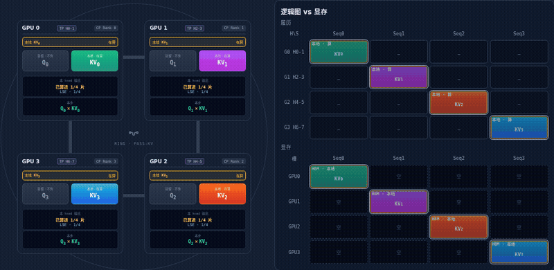

# llm-engine-viz：交互式 LLM 推理可视化

**站点：** https://kevinez06.github.io/llm-engine-viz/

**源码：** https://github.com/KevinEZ06/llm-engine-viz

**环境：** 浏览器打开即可，页面把原理做成可视化动画，配合 zero-to-sglang 阅读。

## 页面

| 页面 | 讲什么 |
|------|--------|
| [总览](https://kevinez06.github.io/llm-engine-viz/) | 按章节串起来 |
| [一个 Token 从输入到输出](https://kevinez06.github.io/llm-engine-viz/journey.html) | 网关 → K8s → P/D → 输出 |
| [连续批](https://kevinez06.github.io/llm-engine-viz/batching.html) | 静态批 / 连续批 / chunk |
| [PagedAttention](https://kevinez06.github.io/llm-engine-viz/PagedAttention.html) | KV 怎么分页存 |
| [KV 调度](https://kevinez06.github.io/llm-engine-viz/cacheschedule.html) | Swap / Recompute |
| [Radix](https://kevinez06.github.io/llm-engine-viz/radix.html) | 前缀树与 LRU |
| [推测解码](https://kevinez06.github.io/llm-engine-viz/mtp.html) | 先猜再核 |
| [TP/DP/EP/CP](https://kevinez06.github.io/llm-engine-viz/parallel.html) | 怎么切、怎么通信 |
| [Ring / CP](https://kevinez06.github.io/llm-engine-viz/ring_attention.html) | Ring Attention |
| [PD 分离](https://kevinez06.github.io/llm-engine-viz/kvpd.html) | KVPoll 分卡交接 |
| [路由](https://kevinez06.github.io/llm-engine-viz/pipeline.html) | SMG 路由打分 |
| [K8s](https://kevinez06.github.io/llm-engine-viz/k8s.html) | K8s + Mooncake |

## 怎么用

打开站点点页面即可。建议先总览，再按课程章节对照进各页。

## 许可

本页与站点内容采用 CC BY-NC-SA 4.0，与课程正文一致。
