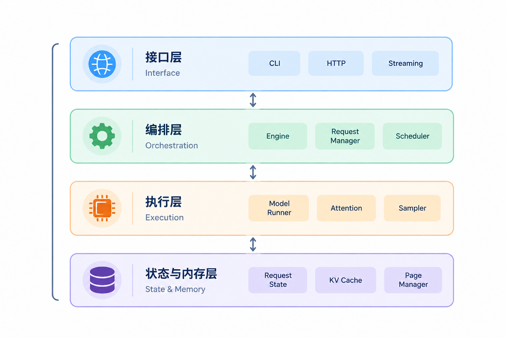
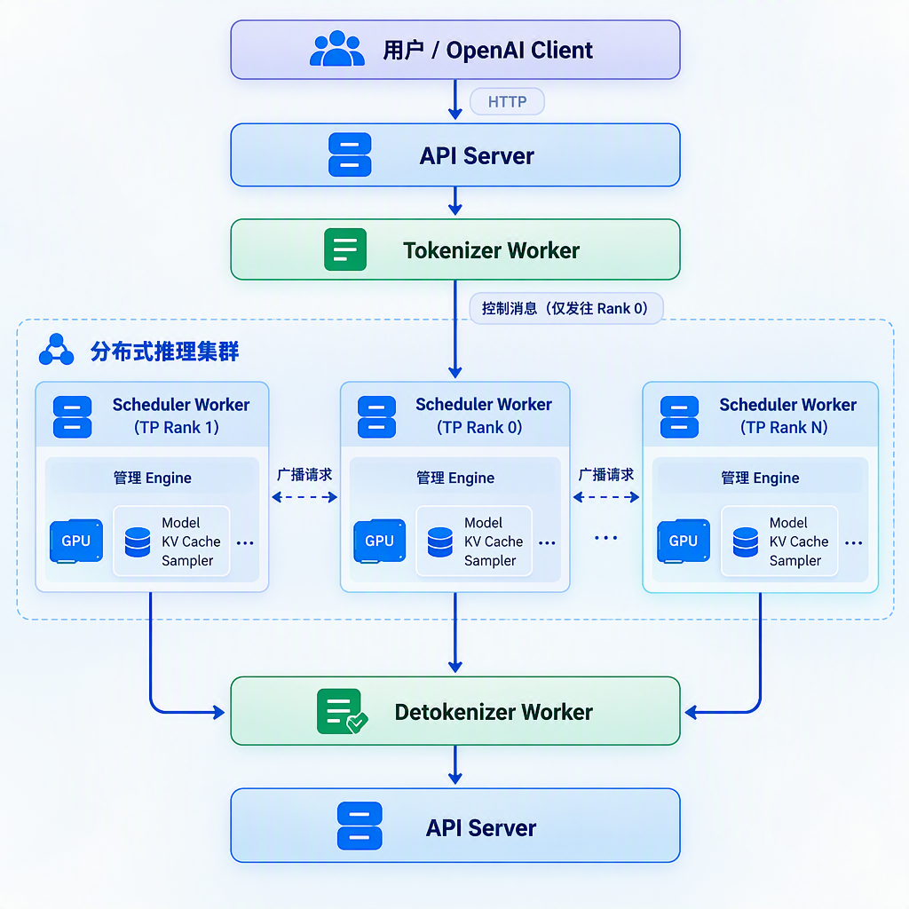
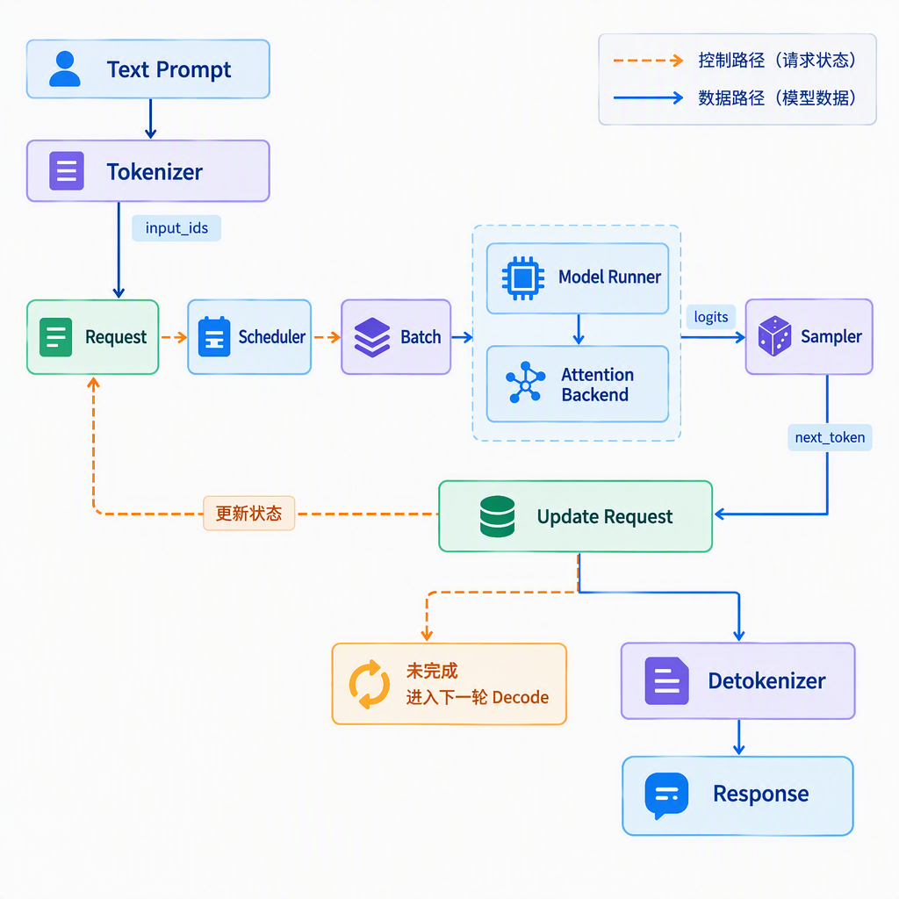
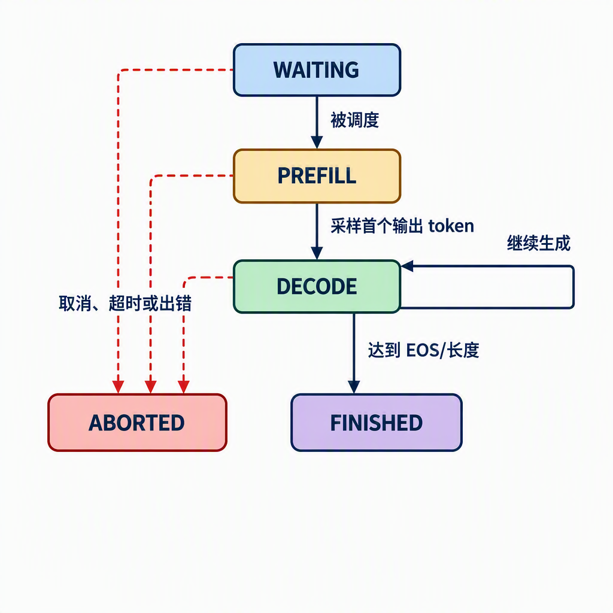

# 第 1 章 mini-sglang：推理引擎长什么样

Part I 里，我们已经从模型和硬件的角度理解了 LLM 推理：模型以自回归方式逐个生成 token，Prefill 负责处理输入上下文，Decode 负责生成后续 token，而 KV Cache 用来避免重复计算历史信息。我们还学习了 TTFT、TPOT、吞吐等指标，知道一个推理系统不能只追求“能生成”，还要在延迟、吞吐和显存占用之间取得平衡。

不过，这些概念还没有呈现出一个完整推理系统的工作过程。一个用户请求进入系统后，谁负责接收它？谁决定这一轮处理哪些请求？模型计算产生的 KV Cache 放在哪里？生成的 token 又怎样被转换成流式响应？这些就是推理引擎要解决的问题。

本章不急着实现某一种具体优化，而是先梳理 mini-sglang 的整体结构。我们会从一个最简单的模型调用出发，逐步认识请求、批次、调度器、模型执行器、缓存和服务接口之间的关系。后续章节会沿着这条脉络逐章补充新的能力，让一个能生成文本的程序逐渐成为真正的推理引擎。

## 1 本章学习目标

读完本章后，你应该能够：

- 解释“模型调用”和“推理引擎”之间的区别；
- 画出一个最小推理引擎的主要模块及其数据流；
- 描述一个请求从进入系统到返回结果所经历的基本状态；
- 理解 `Req`、`Batch`、`Context` 等核心对象分别保存什么信息；
- 说明 Part II 为什么按照“正确性 → 效率 → 服务化 → 调度 → 内存管理 → 扩展”的顺序实现 mini-sglang。

本章暂不展开 Attention 的数学推导、KV Cache 在显存中的组织与管理方式、Continuous Batching 的调度算法，也不讨论多卡通信的底层实现。这些内容会在后续章节中逐一实现和验证。

## 2 从模型调用到推理引擎

### 2.1 从自回归生成循环开始

先看一个概念上最简单的自回归生成循环。它假设模型已经加载完成，`model` 能够根据输入 token 返回 logits：

```python
input_ids = tokenizer.encode(prompt)

for _ in range(max_new_tokens):
    logits = model(input_ids)
    next_token = sample(logits[:, -1, :])
    input_ids = append(input_ids, next_token)

output = tokenizer.decode(input_ids)
```

这段代码展示了生成文本所需的基本步骤：编码输入、执行前向计算、采样下一个 token、把新 token 接回序列，然后重复执行。它说明了模型如何根据已有序列生成下一个 token，但还没有处理运行推理服务时所需的请求管理、计算调度和资源管理。

即使只处理一个请求，这段程序也存在明显的重复计算：每一轮都会把完整的 `input_ids` 重新送入模型。随着序列变长，历史 token 对应的中间结果会被反复计算。Part I 介绍的 KV Cache 可以复用这些结果，减少 Decode 阶段的计算。

如果还要让它同时服务多个用户，问题会进一步从“怎样生成一个 token”扩展到“怎样持续组织一批请求”。此时系统必须明确请求状态由谁记录、每轮计算由谁安排、模型由谁执行，以及计算产生的缓存由谁管理。具体来说，需要回答以下问题：

- 同时到达的多个请求应该如何排队？
- 哪些请求应该在同一轮一起执行？
- 请求已经生成了多少 token，是否达到停止条件？
- 历史 token 对应的 Key 和 Value 应该保存在哪里？
- 一个请求结束后，如何释放它占用的缓存空间？
- 生成的 token 如何转换成文本并返回给客户端？

因此，推理引擎并不是把模型包一层 HTTP 就结束了。更准确地说：**模型负责完成神经网络计算，推理引擎负责组织这些计算。** 它需要管理请求的生命周期、安排计算顺序、保存中间状态，并把底层计算包装成稳定的服务接口。

### 2.2 推理引擎的四项核心职责

可以把推理引擎的职责归纳为四类。

第一类是**输入输出管理**。引擎接收文本、采样参数和长度限制，将文本转换成 token IDs；生成结束后，再把 token IDs 转回文本，必要时逐 token 流式返回。Tokenizer 和 Detokenizer 分别负责文本编码与生成结果解码，通常属于这一类。

第二类是**请求编排**。每个请求都有自己的输入长度、已生成长度、停止条件和缓存状态。引擎需要记录这些状态，并在请求完成、取消或出错时做清理。

第三类是**计算调度**。GPU 更适合批量执行矩阵运算，但不同请求的输入和输出长度并不相同。调度器需要决定每一轮将哪些请求放进 batch，以及这一轮执行 Prefill 还是 Decode。

第四类是**状态和内存管理**。Decode 会持续产生新的 KV Cache。引擎不仅要保存这些数据，还要处理缓存空间分配、复用和释放，为后续的分页缓存与前缀复用打下基础。

> 总结：推理引擎决定“为谁算、何时算、算哪些 token，以及算完之后如何保存结果”。

## 3 mini-sglang 的总体架构

### 3.1 从职责分层到进程结构

上一节明确了推理引擎需要承担的职责。为了进一步理解这些职责如何组成一个完整系统，我们先从逻辑上把 mini-sglang 划分为四层：

<div align="center">
  
  <p><em>图 1.1 mini-sglang 的教学分层</em></p>
</div>

这四层按照职责组织推理引擎中的不同模块，帮助我们先看清各部分分别解决什么问题。它们是逻辑上的分层，并不与运行时进程一一对应。

- **接口层**：关心请求怎样进来、结果怎样出去；
- **编排层**：关心当前有哪些请求、这一轮执行什么；
- **执行层**：关心模型如何完成一次前向和采样；
- **状态与内存层**：关心请求的历史信息和缓存数据放在哪里。

在后续的教学实现中，我们会先用少量 Python 模块承载这些职责，以便观察完整的数据流。官方实现则将它们拆分到多个 worker 进程中，通过进程间消息和分布式通信协作。两者采用相近的职责划分，但运行方式不同。

逻辑分层说明了各类职责之间的关系，但并不直接反映系统运行时的组织方式。如果把视角从“模块负责什么”切换到“由哪些进程执行”，官方 mini-sglang 的结构会更接近下面的形式：

<div align="center">
  
  <p><em>图 1.2 mini-sglang 的进程视图</em></p>
</div>

图中，API Server 是面向用户的入口；Tokenizer Worker 和 Detokenizer Worker 分别负责文本与 token 之间的转换；Scheduler Worker 管理请求和执行时机，Engine 则负责模型、缓存和实际计算。这里需要理解的是，不同职责可以由独立进程承担并相互协作，暂时不必记住进程的启动方式和通信细节。

分层视图和进程视图分别回答了“系统包含哪些职责”和“这些职责如何运行”。接下来，我们沿着请求的流转过程，观察这些模块怎样协同工作。

### 3.2 请求如何在架构中流转

一个请求进入系统后，既会触发请求状态的变化，也会带动模型数据在不同模块之间传递。为了区分这两类信息，可以将请求的流转过程分为控制路径和数据路径：

<div align="center">
  
  <p><em>图 1.3 mini-sglang 的控制路径与数据路径</em></p>
</div>

- **控制路径**传递请求状态：请求是否在等待、是否正在 Prefill、是否可以 Decode、是否已经结束。它主要由 Engine 和 Scheduler 处理。

- **数据路径**传递模型计算所需的数据：`input_ids`、位置、logits 以及 KV Cache。它主要经过 Batch、Model Runner 和 Attention 后端。

控制路径决定“这一轮算谁”，数据路径决定“这一轮拿什么数据来算”。区分这两条路径，有助于分别理解调度决策和模型计算；后续章节也会从这两个角度分析新增机制带来的变化。

映射到官方实现时，这两条路径会跨越多个进程。第一章只建立整体视图，下一章再沿真实代码追踪请求从 API Server 到 Scheduler、Engine 和 Detokenizer 的完整过程。

控制路径记录了请求当前处于哪个处理阶段。为了描述请求从进入系统到生成结束的过程，下面用一个简化的状态机表示其主要状态：

<div align="center">
  
  <p><em>图 1.4 请求的简化状态机</em></p>
</div>

各状态的含义如下：

- `WAITING`：请求已被接收，但还没有进入模型计算；
- `PREFILL`：处理输入 prompt，建立初始 KV Cache，并计算生成首个输出 token 所需的 logits；
- `DECODE`：每轮处理新生成的 token，并追加 KV Cache；
- `FINISHED`：遇到结束 token 或达到最大生成长度；
- `ABORTED`：请求被取消、超时，或执行过程中发生错误。

这是一种用于梳理流程的教学抽象，并不表示源码中一定存在同名的状态定义。真实系统还可能区分排队、暂停、抢占等更多情况。这里保留最主要的状态，用来解释后续的生成、调度和缓存回收。

状态机描述了请求经历的阶段，但还没有呈现各个模块在这些阶段中的具体工作。假设用户发送：

```text
Prompt: 请解释什么是 KV Cache？
max_new_tokens: 8
```

它在引擎中的大致经历如下：

1. Server 收到文本和生成参数；
2. Tokenizer 将文本编码为 `input_ids`；
3. 系统创建一个请求对象，并将其放入等待队列；
4. Scheduler 选择该请求，组织 Prefill batch；
5. Model Runner 完成前向计算，写入初始 KV Cache；
6. Sampler 根据 logits 选择第一个 token；
7. 请求转入 Decode，每轮生成一个后续 token；
8. 达到长度限制后，Detokenizer 将 token IDs 转成文本并返回。

这八个步骤把前面介绍的进程、控制路径和数据路径连接到了一起。后续章节会不断回到这个例子：第 3 章实现第 5～7 步的最小版本；第 4 章减少 Decode 中的重复计算；第 5 章为它增加 HTTP 和流式返回；第 6 章让多个请求共享调度循环；第 7、8 章再处理缓存空间和前缀复用。

### 3.3 从架构模块到源码结构

前两节从系统运行的角度介绍了 mini-sglang。要把这些认识用于阅读和编写代码，还需要知道各项职责在源码中的位置。官方 mini-sglang 的源码位于 `python/minisgl/`。本章以 2026 年 9 月 16 日的 `main` 提交 `9a91cfafe754aa85daee49998176275667eb58f2` 为参考基线。该版本按主要职责划分出多个子包：

```text
python/minisgl/
├── attention/       # Attention 后端与元数据
├── benchmark/       # 基准测试
├── distributed/     # 分布式执行
├── engine/          # 单个 TP Worker 上的模型、缓存、执行与采样
├── kernel/          # 底层计算 kernel
├── kvcache/         # KV Cache 池、句柄和不同缓存实现
├── layers/          # Transformer 层
├── llm/             # 面向 Python 用户的 LLM 接口
├── message/         # worker 之间传递的可序列化消息
├── models/          # 模型结构
├── moe/             # MoE 相关后端
├── scheduler/       # 调度器、请求队列和批次管理
├── server/          # API Server、命令行参数与启动逻辑
├── tokenizer/       # Tokenize 与 Detokenize
├── utils/           # 通用工具
├── core.py          # 跨模块共享的数据结构
└── __main__.py      # python -m minisgl 的入口
```

这份目录结构不要求读者现在就读完所有源码。它的作用是建立“遇到一个问题，应该去哪里找”的索引：想看请求和 batch 的状态，先看 `core.py`；想看调度，先看 `scheduler/`；想看缓存，先看 `kvcache/`；想看服务入口，先看 `server/`。

还可以从功能反向定位代码：想了解模型结构和权重加载，查看 `models/`；想了解张量并行的线性层和通信，查看 `layers/` 与 `distributed/`；想了解不同 Attention 实现，查看 `attention/`；想了解底层 CUDA kernel，查看 `kernel/`。这种“按问题找模块”的方式，比从目录第一行开始逐文件阅读更适合第一次理解推理引擎。

除了按目录划分功能，mini-sglang 还通过共享数据结构连接不同模块。`core.py` 集中定义了这类对象，其中最重要的是 `SamplingParams`、`Req`、`Batch` 和 `Context`。理解这些对象分别保存什么，以及它们如何关联，可以帮助我们看清请求状态、批次计算和运行环境之间的关系。

`SamplingParams` 保存采样相关配置，例如温度、`top_k`、`top_p`、是否忽略 EOS 以及最大生成长度。将这些参数放进独立对象，可以避免把一长串可选参数散落在 Engine、Sampler 和 Server 的接口中。

`Req` 表示单个请求。官方实现中，它至少需要记录：

- 输入 token IDs；
- 当前序列长度和最大长度；
- 已经被缓存的长度；
- 请求的唯一标识；
- 采样参数；
- 对应的缓存句柄。

其中，“当前序列长度”和“已缓存长度”是两个不同概念。前者表示请求已经拥有多少 token，后者表示其中多少 token 的 Key、Value 已经可以被当前执行路径复用。官方实现中的 `extend_len` 正是二者之差；这个区别会在 KV Cache 章节变得非常重要。

`Batch` 表示一次模型执行所需的一组请求。它不仅保存请求列表，还会在调度阶段准备本轮的 `input_ids`、位置、输出位置和 padding 信息，Attention 后端还会为它补充计算所需的元数据。官方实现用 `phase` 区分 `prefill` 和 `decode`，因为两个阶段的输入组织方式和 Attention 访问模式不同。换句话说，`Batch` 承接了 Scheduler 的调度结果，并将其整理成模型可以执行的输入。

`Context` 保存一次前向执行共享的运行时依赖，例如 Attention 后端和 KV Cache 池。它服务于当前执行过程，而不属于某一个请求。其内部的数据布局与缓存管理细节将在后续章节展开。

可以用下面的关系概括这四个对象：

```text
Context
  ├── KV Cache Pool
  ├── Attention Backend
  └── 当前 Batch
          └── 多个 Req
                  └── SamplingParams + Cache Handle
```

至此，我们已经从职责、进程、请求流转和源码目录四个角度建立了 mini-sglang 的整体认识。下一节将以这张架构地图为基础，说明 Part II 如何逐步补齐一个推理引擎所需的能力。

## 4 Part II 的实现路线

### 4.1 为什么采用增量实现

完整推理引擎同时涉及模型结构、批处理、异步服务、GPU 内存、缓存策略和多卡通信。如果一开始把所有功能放在一起，代码虽然可能很快变长，但很难分辨每种机制解决了什么问题。

本部分采用增量实现：每一章先观察当前版本的限制，再增加一个针对性模块，最后用正确性测试或 benchmark 验证变化。每次只引入一个主要概念，读者能够看到系统为何需要它，以及它如何改变数据流。

按照这种增量实现方式，Part II 会依次补齐请求流转、模型生成、缓存、服务化、调度和多卡扩展等能力，具体安排如下。

| 章节 | 当前版本的主要限制 | 新增能力 | 主要验证 |
|---|---|---|---|
| 第 2 章 | 已了解整体架构，但尚未深入请求在真实源码中的流转过程 | 跟踪请求从入口到响应的完整路径 | 画出请求链路并定位关键文件 |
| 第 3 章 | 还不能完成真正的自回归生成 | 前向传播、生成循环、采样 | 输出正确性 |
| 第 4 章 | Decode 会重复计算历史 token | KV Cache | 计算量、TPOT |
| 第 5 章 | 只能通过 Python 函数调用 | HTTP、并发请求、流式返回 | 端到端延迟 |
| 第 6 章 | 请求只能逐个或静态批处理 | Continuous Batching、Scheduler | 吞吐、TTFT |
| 第 7 章 | 缓存分配浪费空间并产生碎片 | Paged KV Cache、内存管理 | 显存利用率、并发数 |
| 第 8 章 | 相同前缀会被重复计算 | RadixAttention、Prefix Caching | 命中率、TTFT |
| 第 9 章 | 单卡受到模型容量和吞吐限制 | 多进程、Tensor Parallelism | 多卡扩展效果 |
| 第 10 章 | 每个输出 token 都要走完整模型 | Speculative Decoding | 接受率、生成速度 |

### 4.2 由问题驱动的实现顺序

上表列出了各章新增的能力。它们并不是彼此独立的功能，而是由前一个版本暴露的问题逐步推导出来的。将这些问题串联起来，可以得到下面这条实现路径：

```text
先读懂请求如何流转
        ↓
先保证生成正确
        ↓
发现历史计算重复 → KV Cache
        ↓
发现程序无法服务用户 → HTTP / Streaming
        ↓
发现多个请求互相等待 → Continuous Batching / Scheduler
        ↓
发现缓存占用和碎片化 → Paged KV Cache
        ↓
发现请求之间存在共享前缀 → Prefix Caching
        ↓
发现单卡容量和算力不足 → Tensor Parallelism
        ↓
发现 Decode 仍然逐 token 受限 → Speculative Decoding
```

后续各章引入的新机制都应该回答四个问题：

1. 当前实现的瓶颈是什么？
2. 新机制改变了哪一部分数据流或控制流？
3. 代码中需要增加哪些对象和接口？
4. 用什么实验指标证明它确实有效？

沿着这条问题链，读者每次只需要理解一个新增机制，并观察它如何改变已有系统。最终得到的不只是一个可以运行的 mini-sglang，还包括一套分析推理引擎问题的方法。

## 5 总结与测试题

### 5.1 课程总结

本章了解了 mini-sglang 的整体概况：模型负责前向计算，推理引擎负责请求管理、调度、缓存、采样和服务化。一个请求通常会经历 `WAITING → PREFILL → DECODE → FINISHED` 的生命周期；Part II 则沿着真实问题逐步为这个生命周期补齐效率和工程能力。

三个核心要点是：

1. “能调用模型”只是推理引擎的起点，不是终点。
2. `Req`、`Batch` 和 `Context` 将请求状态、一次执行和运行时环境连接起来。
3. Part II 的实现顺序由问题驱动：先读懂请求路径并保证生成正确，再逐步解决重复计算、服务并发、缓存管理和扩展性问题。

### 5.2 测试题

1. 为什么一个能够运行 `model(input_ids)` 的程序还不能称为完整的推理引擎？

2. 推理引擎和模型本身分别负责哪些工作？请至少各列出三项。

3. `Req`、`Batch` 和 `Context` 分别表示什么？它们之间有什么关系？

4. 一个请求从进入系统到返回结果，可能经历哪些状态？在什么情况下会进入 `FINISHED` 或 `ABORTED`？

5. 为什么要把控制路径和数据路径区分开？请分别举出它们传递的信息。

6. Part II 为什么先实现单请求生成，再实现 KV Cache、HTTP 服务和 Continuous Batching？如果调换顺序，学习和调试会遇到什么困难？

7. 官方 mini-sglang 的 `engine`、`scheduler`、`kvcache`、`server` 和 `tokenizer` 目录分别承担什么职责？

## 参考资料

- [mini-sglang 官方仓库（参考提交 9a91cfa）](https://github.com/sgl-project/mini-sglang/tree/9a91cfafe754aa85daee49998176275667eb58f2)
- [mini-sglang：`python/minisgl` 源码目录](https://github.com/sgl-project/mini-sglang/tree/9a91cfafe754aa85daee49998176275667eb58f2/python/minisgl)
- [mini-sglang：Structure of Mini-SGLang](https://github.com/sgl-project/mini-sglang/blob/9a91cfafe754aa85daee49998176275667eb58f2/docs/structures.md)
- [mini-sglang：`core.py`](https://github.com/sgl-project/mini-sglang/blob/9a91cfafe754aa85daee49998176275667eb58f2/python/minisgl/core.py)
- [SGLang 官方仓库](https://github.com/sgl-project/sglang)
