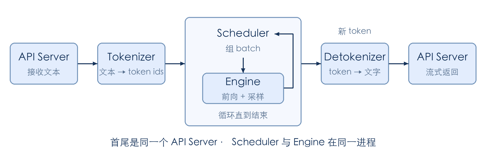

# 第 2 章 一个请求的旅程

上一章介绍了推理引擎由哪些模块组成。本章沿着一条请求，把这些模块串起来。主要大家需要区分的就几块：**tokenizer，scheduler，engine（包括attention backend，forward，memory allocation等，不过在此只需要知道模块大概是啥）；以及前端的serving。**

本章先讲清请求链路和进程分工。运行命令、消息类型与源码走读放在配套的 [coding 文档](./第2章_一个请求的旅程_代码.md)；下一章再动手实现模型前向与生成循环。

## 1 本章学习目标

完成本章学习后，你将能够：

1. 画出一条请求从进入服务到返回结果的完整链路，说明每个组件的输入、输出和职责。
2. 区分调度器与计算引擎，说明 prefill 和 decode 在请求生命周期中的位置。
3. 解释流式输出为什么需要保留解码状态，以及请求结束或取消后为什么要回收资源。
4. 说明多进程设计带来的并行、扩容与排查便利，以及相应的通信成本。

## 2 一条请求的旅程

假设用户发来“什么是 KV Cache？”，并希望边生成边看到回答。这条请求可以按五个环节理解：接收请求、分词、调度与计算、反分词、返回结果。最后一个环节由最初接单的 API Server 完成；这五个环节并不对应五个独立进程。

### 2.1 前台接收请求

API Server 是服务的前台，负责接收 HTTP 请求，读取用户输入和采样参数，并为请求分配内部唯一标识。后续消息携带这个标识，前台才能把不同请求的生成结果送回各自的连接。

把请求交给下一站之后，前台还需要继续接收其他用户的请求。等待模型生成期间，它保留当前请求的响应状态。

### 2.2 tokenizer 把文字转成 token

模型接收的是 token id，而不是字符串。tokenizer 把文本转换成一串整数；如果输入是多轮对话，还要先通过 chat template 把角色和对话内容组织成模型所需的格式。

这一站改变的是输入的表示方式：文本变成 token ids，请求标识和采样参数仍随请求向后传递。

### 2.3 scheduler 排班，engine 执行计算

scheduler 是调度器。新请求进入等待队列后，由它决定下一步执行哪些请求、组成怎样的 batch，以及显存能否容纳这些请求的 KV Cache。

请求开始时，模型先处理 prompt，这个阶段叫 prefill；随后进入 decode，每一步利用已有上下文生成后续 token。本章讨论普通自回归生成，每次推进通常为请求产生一个新 token，投机解码留到后续章节。

真正执行模型前向和采样的是 engine。scheduler 决定“算谁”，engine 负责“怎么算”。在 mini-sglang 中，两者位于同一个进程，scheduler 直接调用 engine；模块边界不一定就是进程边界。

模型前向输出 logits，也就是词表中各个候选 token 的分数，还不是概率。采样器根据这些分数选出下一个 token：greedy 直接选择分数最高的候选；带温度的随机采样先调整 logits，再用 softmax 转成概率，最后按概率抽取。新 token 接回请求的序列，作为下一步生成的上下文。

### 2.4 detokenizer 把 token 转回文字

detokenizer 将新生成的 token ids 转换成文字。这里不能简单地把每个 token 单独解码再拼接：有些 token 只包含一个字符的部分字节，单独解码可能出现替代字符或不完整文本。

因此，反分词（aka detokenize）需要保留每条请求的解码状态，结合已有 token 判断哪些文字已经完整，只把新增的可输出部分交给前台。

### 2.5 前台流式返回结果

严格意义上这不是一个性能优化的feature，而是优化TTFT和用户体验。开了流式返还（streaming output）之后，每一段增量文字携带请求标识回到 API Server。前台找到对应的 HTTP 连接，通过 SSE（Server-Sent Events）分块返回结果，让用户不必等整段回答生成完。用户感知到的就是模型在一个字一个字的吐输出。如果是非流式，则会等待完整decode完成，用户才能收到答案。现在几乎所有用户端都是流式输出，可能在22年的古早GPT时代才有非流式客户端了（？

达到生成长度上限或满足结束条件时，请求停止生成，前台完成响应。如果用户中途断开连接，引擎也需要取消请求并回收资源，避免继续执行已经无人接收的计算。

### 2.6 把整条链路串起来

下面把请求经过的模块画在一起。图的左右两端是同一个 API Server；scheduler 与 engine 放在同一个框内，表示它们运行在同一进程，通过函数调用配合。生成循环每产生一个新 token，就会把结果交给 detokenizer，再由前台返回新增文字。

请求依次经过三次主要的表示转换：输入文本转换成 token ids，模型根据上下文生成新 token，反分词再把输出 token 转回文本。请求标识贯穿整条链路，让各阶段能够关联同一个请求。

读到这里，大家可以自查：能否说明每个环节处理的数据形式、scheduler 与 engine 的职责区别，以及生成循环从哪里开始、在哪里结束？

## 3 为什么拆成多个进程

上一节画的是一条请求的路径，但真实服务会同时处理许多请求：有的刚到达，有的正在分词，还有的已经开始生成。HTTP 收发主要涉及网络 I/O，分词和反分词主要消耗 CPU，模型前向主要使用 GPU。如果串行完成这些工作，符合短板原理场景，即一个环节变慢，就可能让其他环节一起等待。

进程划分要解决的就是“不同请求、不同阶段怎样同时往前走”。在系统设计上，mini-sglang 将这些工作组织到不同进程中，各自维护状态，并通过通信交接任务。好处是可以叠加工作规避短板原理，坏处是通信本身是额外开销。

### 3.1 让不同组件重叠工作

假设请求 A 正在生成回答，此时请求 B 带着一段很长的 prompt 到达。如果调度循环必须先完成 B 的分词，才能为 A 发起下一步计算，A 的输出就可能出现停顿，GPU 也可能等待 CPU 提交任务。拆开以后，tokenizer 处理 B 的输入，scheduler 同时推进 A；只有 B 自己需要等分词完成后才能加入计算。

SGLang 的常规单 tokenizer 服务模式就是一个实际例子：HTTP Server 与 TokenizerManager 在同一进程，scheduler 和 detokenizer 分别运行在子进程，使输入处理和输出解码与 GPU 调度分开。具体分工可见 [SGLang 启动实现](https://github.com/sgl-project/sglang/blob/main/python/sglang/srt/entrypoints/engine.py)。

单进程也能借助线程、异步 I/O 和异步 GPU 执行实现并发。多进程便于分开管理这些执行流程，但不会消除单条请求内部的依赖。

### 3.2 组织多卡协同

当模型无法放进一张 GPU，或希望用多卡分担计算时，就需要让多个执行单元协同工作。以四卡张量并行为例，每张卡保存部分模型权重，执行相应的计算，并通过集合通信交换结果，共同完成一次前向。

mini-sglang 为每张 GPU 启动一个 scheduler worker，SGLang 的张量并行也按 rank 创建对应进程，让每个 worker 管理本卡的执行状态。不过，这四个 worker 服务的是同一批请求，必须在调度和通信上保持一致，不能各自独立挑选请求。第 9 章会展开具体实现。

### 3.3 按瓶颈调整组件数量

组件拆开后，还可以针对真正排队的环节增加资源。比如长文本请求很多，输入已在 tokenizer 前排队，而 GPU 还没有足够的就绪请求可算，此时只增加 GPU 未必有效。增加 tokenizer worker，才有机会让多个 CPU 进程分担输入处理，及时向调度器提供任务。

mini-sglang 支持配置 tokenizer 数量，SGLang 也提供多 tokenizer 模式，通过路由组件交接消息，不必为每个 tokenizer 再加载一份 GPU 模型。但如果瓶颈已经在 GPU，增加 tokenizer 只会让后续队列积压更多请求。因此，扩容前要先观察时间花在哪一段。

### 3.4 明确通信和排查边界

拆分后，任务交接从普通函数调用变成了跨进程消息传递。mini-sglang 的控制消息主要通过 ZeroMQ 传输，张量并行中的 GPU 数据交换则使用集合通信。沿着请求标识检查各站日志，就能逐步缩小问题范围：问题究竟出在分词？调度？还是前台server？etc。

这种边界有利于定位问题，却不会自动提供故障恢复。某个进程退出时，它持有的请求状态可能丢失，其他进程还可能等待它的消息，因此仍需要协调退出、清理或重启。消息传输、初始化和状态同步也都有成本；独立地址空间并不意味着进程间绝不能使用共享内存。

拆进程以通信和管理成本换取执行重叠与清晰的资源归属。后续将 prefill 与 decode 拆到不同机器，还需解决 KV Cache 传输和跨节点调度，不能只靠拆进程完成。

读到这里，大家可以自查：能否举出适合重叠执行的两项工作、解释多卡 worker 为什么要协同，以及说出多进程带来的至少一项成本？

## 4 总结与测试题

### 4.1 课程总结

1：请求的路线。一条请求经过 API Server、tokenizer、scheduler 与 engine、detokenizer，再由 API Server 返回结果。请求标识连接各阶段的状态；tokenizer 和 detokenizer 完成文本与 token 之间的转换，scheduler 管理计算顺序和资源，engine 执行模型前向与采样。

2: 设计多进程的好处。多进程让不同组件能够重叠工作，并为扩容和排查提供清晰的边界。**当然系统设计永远都是tradeoff与平衡，不可能有完美的设计**。多进程也带来通信与同步成本。接下来可以阅读本章 [coding 文档](./第2章_一个请求的旅程_代码.md)，在源码中定位这些职责。

### 4.2 测试题

1. 合上文章，画出请求从进入到返回的完整链路，标注各组件的输入、输出，以及三次主要的表示转换。
2. 在图上标出生成循环，说明 scheduler 和 engine 分别负责什么，以及它们是否必须位于不同进程。
3. 为什么 detokenizer 需要保留每条请求的状态？逐 token 独立解码可能出现什么问题？
4. 用户中途断开连接时，前台和调度器分别需要处理什么？
5. tokenizer 与 scheduler 分成两个进程有什么收益？为什么多进程仍然需要考虑通信成本？

## 参考资料

- [mini-sglang 架构文档：系统组件、请求流程与进程分工](https://github.com/sgl-project/mini-sglang/blob/main/docs/structures.md)
- [mini-sglang 启动入口：进程创建与初始化](https://github.com/sgl-project/mini-sglang/blob/main/python/minisgl/server/launch.py)
- [mini-sglang 调度器：请求调度与生成循环](https://github.com/sgl-project/mini-sglang/blob/main/python/minisgl/scheduler/scheduler.py)
- [SGLang 启动实现：服务进程分工、张量并行与多 tokenizer 模式](https://github.com/sgl-project/sglang/blob/main/python/sglang/srt/entrypoints/engine.py)
