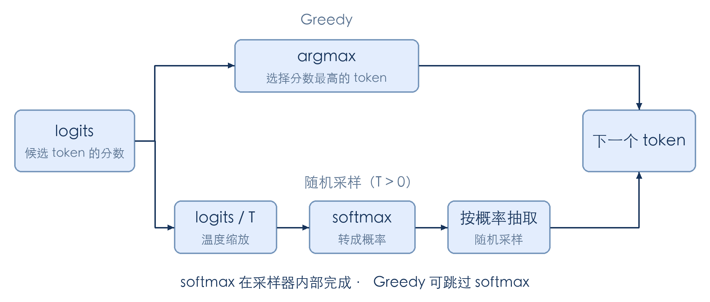

# 第 2 章 一个请求的旅程（代码走读）

概念文档已经把 mini-sglang 基本模块概念介绍了一下。这一章我们发一条请求，然后打开源码，看看它从 HTTP 接口进来以后，经过了哪些函数，最后又是怎么把回答送回终端的。

建议先读本章的[概念文档](./第2章_一个请求的旅程.md)，了解各个模块的分工，再跟着下面的代码看一遍。这里先读懂请求的处理过程，下一章再动手写模型前向和生成循环。

## 1 本章学习目标

完成本章学习后，你将能够：

1. 启动 mini-sglang 服务，发送流式请求并观察相关进程。
2. 找到 API Server、tokenizer、scheduler、engine 和 detokenizer 分别在哪些文件里。
3. 对着代码说清楚：请求在哪里排队，在哪里执行计算，结果又怎么返回。
4. 找到请求正常结束或被用户取消后，负责清理它的代码。

## 2 准备与发送请求

先按 [mini-sglang 安装说明](https://github.com/sgl-project/mini-sglang#2-installation) 完成安装，并启动服务：

```bash
python -m minisgl --model "Qwen/Qwen3-0.6B"
```

另开终端发送请求，观察返回的 SSE 数据块和最后的 `data: [DONE]`：

```bash
curl http://localhost:1919/v1/chat/completions \
  -H "Content-Type: application/json" \
  -d '{
    "model": "Qwen/Qwen3-0.6B",
    "messages": [{"role": "user", "content": "什么是 KV Cache？"}],
    "max_tokens": 128,
    "stream": true
  }'
```

## 3 观察进程与源码入口

在运行服务的机器上查看相关进程：

```bash
ps aux | grep '[m]inisgl'
```

启动代码给几个子进程起了下面这些名字。进程列表的显示方式因系统而异，可以对照源码确认各自的职责：

| 进程                    | 职责                                       |
| ----------------------- | ------------------------------------------ |
| `minisgl-TP0-scheduler` | 单卡时的 scheduler worker，内部调用 engine |
| `minisgl-tokenizer-0`   | 将输入文本转成 token ids                   |
| `minisgl-detokenizer-0` | 将生成 token 转成增量文字                  |
| 主进程                  | 运行 API Server，接收请求和返回响应        |

可以在启动命令后加上 `--num-tokenizer 4`，再看一次进程列表，分词进程会变成 4 个。如果使用张量并行，每张 GPU 还会对应一个 scheduler worker，它们一起处理同一批请求。

下面提到的文件都在 mini-sglang 仓库的 `python/minisgl/` 下。我们会反复碰到几个消息类型，可以先在仓库根目录搜一下，看看哪些文件在使用它们：

```bash
rg -n 'TokenizeMsg|UserMsg|DetokenizeMsg|UserReply|AbortMsg|AbortBackendMsg' python/minisgl
```

## 4 沿请求路径走读源码

接下来按请求经过的顺序读代码。暂时不用弄懂每一个参数，先看当前函数收到了什么、做了什么、又把结果交给了谁。batch 怎么组、显存怎么分配，后面的章节会单独讲。

文中的代码做了节选和简化，`...` 表示省略的部分，不能直接复制运行。阅读时可以把对应源码打开，对照着看。

### 4.1 启动进程：`server/launch.py`

先看这些进程是怎么启动的。`server/launch.py` 解析命令行参数后，用 `multiprocessing` 创建 scheduler、detokenizer 和 tokenizer 子进程，主进程则运行 FastAPI：

```python
# server/launch.py（结构示意，args / kwargs 省略具体值）
for i in range(world_size):
    mp.Process(target=_run_scheduler, args=..., name=f"minisgl-TP{i}-scheduler").start()
mp.Process(target=tokenize_worker, kwargs=..., name="minisgl-detokenizer-0").start()
for i in range(num_tokenizers):
    mp.Process(target=tokenize_worker, kwargs=..., name=f"minisgl-tokenizer-{i}").start()

run_api_server(server_args, start_subprocess, run_shell=run_shell)
```

调用 `.start()` 后，子进程还不能马上接请求：词表和模型需要加载，显存也需要初始化。因此，主进程会等它们准备好。tokenizer 和 detokenizer 各自报告就绪；多个 scheduler 则先同步，再由主 rank 报告就绪。

再看两个 tokenizer 相关的进程，它们的启动函数都是 `tokenize_worker`。分词和反分词共用这段入口代码，具体做哪件事，要看收到的消息类型。

### 4.2 前台：`server/api_server.py`

刚才 curl 发出的请求会进入 `/v1/chat/completions` 对应的处理函数。这个函数为请求分配一个 uid，再把输入和采样参数装进 `TokenizeMsg`，发给 tokenizer：

```python
# server/api_server.py（节选）
@app.post("/v1/chat/completions")
async def v1_completions(req: OpenAICompletionRequest, request: Request):
    state = get_global_state()
    uid = state.new_user()                     # 发号
    await state.send_one(TokenizeMsg(uid=uid, text=prompt, sampling_params=...))
    if req.stream:
        return StreamingResponse(...)          # 返回一个会持续吐字的响应
```

这里返回 `StreamingResponse` 时，回答还没有生成完。它让 HTTP 连接保持打开，后续有了文字，再陆续发给客户端。

那么，生成结果从哪里来？后台有一个一直运行的 `listen` 协程，负责接收 detokenizer 的回复。不同请求的结果会从这里经过，所以它要用 uid 找到对应请求，把结果存下来，再唤醒正在等结果的协程：

```python
# server/api_server.py（节选）
async def listen(self):
    while True:
        msg = await self.recv_tokenizer.get()   # 收回来的结果
        for msg in _unwrap_msg(msg):
            self.ack_map[msg.uid].append(msg)   # 按 uid 存进对应请求的结果列表
            self.event_map[msg.uid].set()       # 唤醒在等这个结果的协程
```

如果这时在 curl 的终端里按 Ctrl+C，客户端就断开了。前台检测到断开后发送 `AbortMsg`，tokenizer 再把它转成 `AbortBackendMsg`，交给 scheduler 取消请求、回收资源。否则用户已经不等了，GPU 还可能继续为这条请求生成 token。

### 4.3 分词：`tokenizer/server.py`

回到正常处理的路径。tokenizer 收到前台发来的 `TokenizeMsg`，把文本转成 token ids，再装进 `UserMsg` 发给 scheduler。uid 和采样参数也一起传过去：

```python
# tokenizer/server.py（节选）
while True:
    pending_msg = _unwrap_msg(recv_listener.get())        # 收
    ...
    tensors = tokenize_manager.tokenize(tokenize_msg)     # 文本 → token ids
    send_backend.put(BatchBackendMsg(data=[
        UserMsg(uid=msg.uid, input_ids=t, sampling_params=msg.sampling_params)
        for msg, t in zip(tokenize_msg, tensors)
    ]))                                                   # 发
```

刚才的 curl 用的是 `messages` 对话格式，所以分词前还要套用 chat template，把角色和对话内容拼成模型需要的文本格式。完成分词后，scheduler 收到的就是 `input_ids`，不需要再处理原始字符串。

### 4.4 调度：`scheduler/scheduler.py`

scheduler 收到 `UserMsg` 后，不会马上调用模型。它先检查输入长度，超过模型上限的请求无法继续处理；通过检查的请求进入等待队列，相关代码在 `scheduler/prefill.py`。

排队之后，什么时候轮到它计算？这就要看 scheduler 的循环了。下面用 `normal_loop` 说明最基本的流程：收消息、组 batch、执行计算、处理结果。实际实现还有让调度与计算重叠的 `overlap_loop`，这里先看普通版本：

```python
# scheduler/scheduler.py（简化）
def normal_loop(self) -> None:
    blocking = not (self.prefill_manager.runnable or self.decode_manager.runnable)
    for msg in self.receive_msg(blocking=blocking):  # ① 有计算任务时不阻塞，空闲时等待
        self._process_one_msg(msg)
    forward_input = self._schedule_next_batch()    # ② 挑人，组 batch
    ongoing = None
    if forward_input is not None:
        ongoing = (forward_input, self._forward(forward_input))   # ③ 交给 GPU 算一步
    self._process_last_data(ongoing)               # ④ 处理算完的结果
```

先看第 ② 步。代码先尝试组一个 prefill batch，处理等待中的输入；如果没有组出可执行的 prefill batch，才尝试组 decode batch，让正在生成的请求继续算下一个 token：

```python
# scheduler/scheduler.py（节选）
batch = (
    self.prefill_manager.schedule_next_batch(self.prefill_budget)
    or self.decode_manager.schedule_next_batch()
)
```

这里不只是从队列里取几个请求。调度器还要检查 KV Cache 能不能放得下、是否有已缓存的前缀可以复用，以及这一批的 token 数有没有超过预算。所以，队列里有请求，也不代表这一轮一定能安排它计算。

第 ③ 步怎么调用 GPU，我们下一小节再看。先看算完以后的第 ④ 步：scheduler 把新 token 接到请求的序列末尾，检查是否达到 `max_tokens`，或者是否生成了 EOS。`ignore_eos` 为真时，则不因为 EOS 停止生成。

还没结束的请求留待后续循环继续处理，结束的请求释放资源。新 token 连同 uid 和结束状态一起装进 `DetokenizeMsg`，发给 detokenizer。下面省略了分块 prefill 等分支：

```python
# scheduler/scheduler.py（节选）
for i, req in enumerate(batch.reqs):
    req.append_host(next_token)                        # 新 token 接上
    finished = not req.can_decode                      # 到 max_tokens 了？
    if not req.sampling_params.ignore_eos:
        finished |= next_token == self.eos_token_id    # 生成 EOS 了？
    reply.append(DetokenizeMsg(uid=req.uid, next_token=..., finished=finished))
self.send_result(reply)
```

### 4.5 计算：`engine/engine.py`

现在回来看第 ③ 步。scheduler 组好 batch 后，通过 `_forward` 调用 engine，执行模型前向和采样。两者在同一个进程里，这里就是一次普通的函数调用，不需要像 tokenizer 那样跨进程发消息：

```python
# scheduler/scheduler.py（节选，主循环第 ③ 步调用的就是它）
def _forward(self, forward_input: ForwardInput) -> ForwardOutput:
    batch, sample_args, input_mapping, output_mapping = forward_input
    batch.input_ids = self.token_pool[input_mapping]        # 取出这一圈要算的 token id
    forward_output = self.engine.forward_batch(batch, sample_args)   # 直接函数调用 engine
    self.token_pool[output_mapping] = forward_output.next_tokens_gpu # 新 token 写回池子
    return forward_output
```

进入 `engine.forward_batch` 后，模型先算出 logits，采样器再选出下一个 token，最后把结果从 GPU 拷贝回 CPU，交给 scheduler 处理：

```python
# engine/engine.py（简化）
def forward_batch(self, batch, args):
    logits = self.model.forward()                     # 前向：算出候选 token 的分数
    next_tokens = self.sampler.sample(logits, args)   # 内部处理 softmax 和 token 选择
    next_tokens_cpu = next_tokens.to("cpu", non_blocking=True)   # 结果拷回 CPU
    ...
```

其中，logits 是模型给词表中每个候选 token 打的分，还不是概率。经过 softmax，这些分数才变成总和为 1 的概率。最终选哪个 token，则取决于采样方法：greedy 直接取分数最高的 token；带温度的随机采样先用温度调整 logits，再经过 softmax，最后按概率抽取一个 token。

上面的 `sample(logits, args)` 把这几步封装在了函数内部，并不是拿 logits 当概率直接抽样。打开 [`engine/sample.py`](https://github.com/sgl-project/mini-sglang/blob/main/python/minisgl/engine/sample.py)，把这层调用展开后，可以简化成下面的形式。这里的 `sampling` 指 `flashinfer.sampling`，省略了 top-k、top-p 等分支：

```python
# engine/sample.py（简化，合并 sample 与 sample_impl 的逻辑）
def sample(self, logits, args):
    if args.temperatures is None:                      # 整批请求都使用 greedy
        return torch.argmax(logits, dim=-1)
    probs = sampling.softmax(logits.float(), args.temperatures)  # 温度缩放 + softmax
    return sampling.sampling_from_probs(probs)         # 按概率抽取 token
```

greedy 不需要真的算一遍 softmax，因为它不会改变分数的大小顺序，直接取 logits 的最大值就能得到同一个 token。随机采样则需要概率分布，图中把这两条路径分开画了出来：



图中的随机采样路径只展示温度与 softmax，暂不展开 top-k、top-p。下一章会动手写前向和生成循环，到时再仔细看这几步。

如果想继续往下读，模型结构在 `models/`，attention 的实现在 `attention/`。engine 里还包含 CUDA Graph、异步拷贝等优化，目前先不展开。

### 4.6 反分词：`tokenizer/detokenize.py`

算出的 token 还不能直接显示给用户。detokenizer 收到 `DetokenizeMsg` 后，需要把它转回文字，装进 `UserReply(uid, incremental_output, finished)`，再发给前台。

这里不能每收到一个 token 就单独解码，因为一个 token 可能只包含某个字符的部分字节。detokenizer 会保留每条请求的解码状态，结合前面的内容判断哪些文字已经完整，再取出新增的部分：

```python
# tokenizer/detokenize.py（节选）
new_text = read_str[len(surr_str):]
if len(new_text) > 0 and not new_text.endswith("�"):    # 拼完整了，放行
    output_str = s.decoded_str + new_text
    ...
else:
    new_text = find_printable_text(new_text)             # 没拼完，只放出安全的部分
```

### 4.7 终点：回到前台

还记得前面的 `listen` 吗？`UserReply` 回来后，它根据 uid 存好结果，再调用 `event_map[msg.uid].set()`，通知对应请求“有新结果了”。等结果的协程恢复执行，把新增文字包成 SSE 数据块，通过一直保持打开的 HTTP 连接发给客户端。

这就是终端里回答陆续出现的过程。收到 `finished=True` 后，前台再发送 `data: [DONE]`，结束这次响应。

## 5 对照真实 SGLang

读完 mini-sglang 后，再看 SGLang 源码，可以先从下面这些文件入手。文件的拆法不完全一样，但我们刚才看到的几项工作都能找到对应位置：

| 站点        | mini-sglang               | 真实 SGLang（`python/sglang/srt/`）                                   |
| ----------- | ------------------------- | --------------------------------------------------------------------- |
| 前台        | `server/api_server.py`    | `entrypoints/http_server.py` + `managers/tokenizer_manager.py`        |
| tokenizer   | `tokenizer/server.py`     | `managers/tokenizer_manager.py`                                       |
| scheduler   | `scheduler/scheduler.py`  | `managers/scheduler.py`（`event_loop_normal` / `event_loop_overlap`） |
| engine      | `engine/engine.py`        | `managers/tp_worker.py` + `model_executor/model_runner.py`            |
| detokenizer | `tokenizer/detokenize.py` | `managers/detokenizer_manager.py`                                     |
| 站间通信    | ZMQ                       | ZMQ                                                                   |

SGLang 还要处理 LoRA 加载、权重更新、多模态输入等情况，代码会多不少。第一次读时，可以先跟普通文本请求，顺着它的消息类型找到接收和处理的位置，暂时跳过其他分支。

## 6 总结与测试题

### 6.1 课程总结

回头看刚才的 curl 请求：API Server 接收输入，tokenizer 把文字转成 token ids，scheduler 从队列里选请求、组 batch，再调用 engine 计算。生成的新 token 经 detokenizer 转回文字，最后由 API Server 通过原来的连接返回。

读这几段代码时，uid 是一条很有用的线索：因为uid总是串联始终，跨组件不变。除了正常返回，还要找到请求结束和取消时的清理代码。下一章我们会进入模型内部，动手写前向和生成循环。

### 6.2 测试题

1. 在源码中找到创建请求标识、发送 `TokenizeMsg`、接收 `UserReply` 的位置，确认同一条请求如何关联这些消息。
2. 对照 `_schedule_next_batch` 与 `_forward`，指出哪部分决定“算谁”，哪部分调用 engine。
3. 在流式请求未结束时中断客户端，沿 `AbortMsg` 的处理路径查找请求取消与资源释放逻辑。
4. 找到生成长度上限与 EOS 的判断位置，再找到将结束状态转成 `data: [DONE]` 的位置。

## 参考资料

- [mini-sglang 源码](https://github.com/sgl-project/mini-sglang)
- [mini-sglang 架构文档](https://github.com/sgl-project/mini-sglang/blob/main/docs/structures.md)
- [mini-sglang 采样实现：greedy、温度缩放与 softmax](https://github.com/sgl-project/mini-sglang/blob/main/python/minisgl/engine/sample.py)
- [SGLang 调度器源码](https://github.com/sgl-project/sglang/blob/main/python/sglang/srt/managers/scheduler.py)
