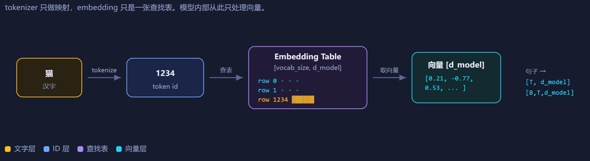
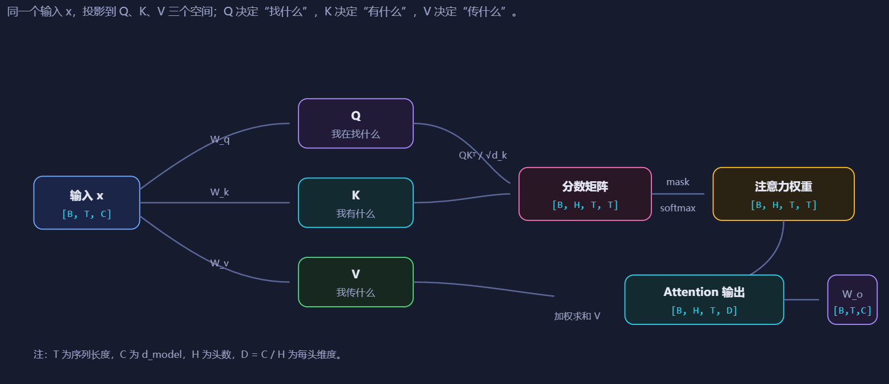
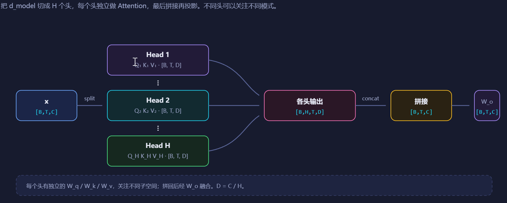
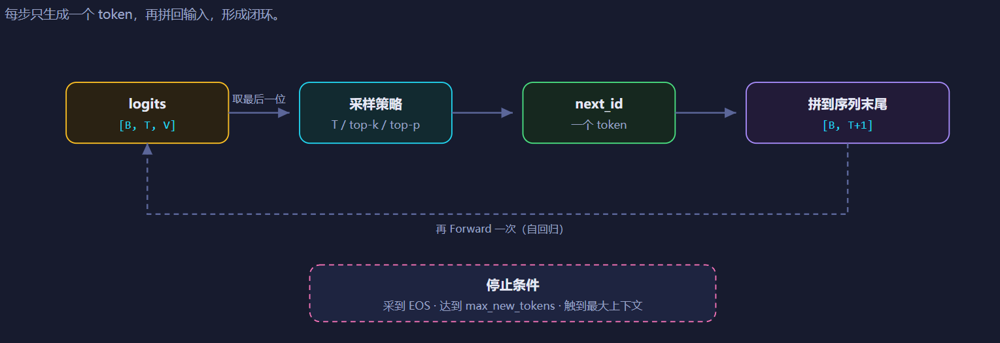
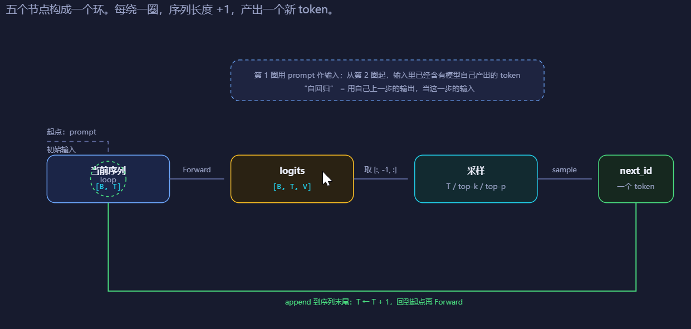
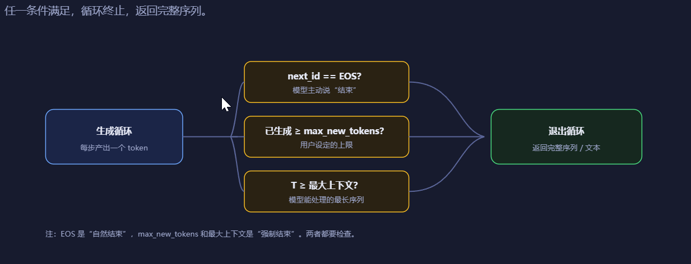

# 3 章 前向与生成

欢迎来到 zero-to-sglang 课程的第二部分第三章。本章将带你建立对大语言模型（Large Language Model, LLM）的前向和生成涉及到的各种概念，为后续深入学习KV cache等推理优化技术推理框架打下基础。

## 1 本章学习目标

学习完本章后，你能够：

1. 能说清楚本章涉及到的各种概念

2. 能说清一个 token 从输入表示，到 Forward Pass 产生 logits，再到采样变成下一个 token 的完整概念链路。

3. 能区分 Forward、Generation、Prefill、Decode、KV Cache 各自解决什么问题，以及它们为什么必须分开理解。

本章只讲概念与数据流，具体实现放在代码篇。读完后，你应当能在不写代码的情况下，深刻认识到前向与生成的全链路。

## 2 Forward Pass 核心：Attention、Block 与 Logits

### 2.1 从汉字到 embedding（tokenize/分词）

一个汉字进入模型，第一步不是计算，是**翻译成一个向量**，这个过程需要用到tokenizer。

**Tokenize（分词/词元化）**，简单说就是：**把一段文本切分成模型能处理的小单元（token），再把这些 token 转成数字 ID**。

可以理解成三步：

1. **原始文本**：`"我爱datawhale"`
2. **切分成 token**：可能变成 `["我", "爱", "datawhale"]`
3. **转成数字 ID**：比如 `[123, 456, 789 ]`

模型真正看到的不是文字，而是这些数字 ID。为什么需要 tokenize？因为神经网络只能处理数字，不能直接读字符串。tokenize 就是把人类文字转换成数字序列的过程。

常见方法有：

- **BPE**：字节对编码，把高频字符组合合并成子词
- **WordPiece**：类似 BPE，常用于 BERT
- **SentencePiece**：常用于多语言模型

**tokenizer 只做映射**，把文字切成 token，再映射成整数 id。它不理解语义，不参与计算。

而**embedding 是一张查找表**，形状是 `[vocab_size, d_model]`。id=123 就去第 123 行取一个向量。这个向量就是模型内部对“我”这个 token 的**初始表示**。此时它还不含上下文信息，只是一个可学习的静态向量。一句话会变成一串 id，查表后变成 `[T, d_model]` 的矩阵；加 batch 维后是 `[B, T, d_model]`，从这一刻起，模型内部只处理向量，不再处理文字。

### 2.2 位置编码：让模型知道顺序

位置编码在第一部分的第一章有介绍，这里只做基础讲解。

Embedding 查表是**按 id 取行**，与位置无关。`"猫追狗"` 和 `"狗追猫"` 的 token 集合一样，但顺序不同，意思完全不同。

所以需要位置编码，把“第几个 token”这个信息注入向量。

常见的**RoPE（旋转位置编码）**：不额外加向量，而是在 Attention 里对 Q/K 做旋转，让点积结果携带相对位置信息。现代 LLM 主流。

做完这一步，每个 token 的向量同时携带了**身份信息（是什么 token）**和**位置信息（在第几位）**。

### 2.3 Attention：token 之间开始通信

到目前为止，每个 token 的向量是独立的，互相不知道对方存在。Attention 是第一个让 token 之间交换信息的站。

**Q/K/V 投影**,把同一个输入向量投影到三个不同空间。Q 代表“我在找什么”，K 代表“我有什么”，V 代表“我实际传递什么”。

**多头拆分**：把 `d_model` 切成 H 个头，每个头独立做 Attention，最后拼回来。不同头可以关注不同模式。

**Causal mask**：把未来位置的分数设为负无穷，保证第 t 个 token 只能看到 1 到 t，不能偷看后面。

Attention 的输出，每个 token 的向量已经混入了它能看到的所有历史 token 的信息。这一步是 Forward Pass 里计算量最大的部分。

### 2.4  Transformer Block： Attention + MLP + 残差 + Norm

一个 Transformer Block 做两件事，第一件事是 Attention 让 token 之间通信。第二件是 MLP 让每个 token 自己消化信息。

结构（Pre-Norm）：

x --> Norm -->  Attention --> 残差加回 --> Norm --> MLP --> 残差加回

**Attention 是跨 token 的**，做信息交换。
**MLP 是单 token 的**，对每个位置独立做非线性变换，不跨位置。
**残差**让梯度直通深层，模型可以堆很多层而不退化。
**Pre-Norm**把 Norm 放在子层之前，训练更稳定，现代 LLM 标配。
Norm 让每层输入分布稳定，避免激活爆炸或消失。

一个 Block 不够，要堆 N 层。N 层之后，每个 token 的向量已经经过了 N 轮信息交换和变换，变成了高度上下文化的表示。

最后接一个 **final norm**，把输出稳定到统一尺度。

### 2.5 LM Head：从向量到 logits

Final norm 输出 `[B, T, d_model]`，但我们需要的是“下一个 token 是什么”。

LM Head 就是一个线性层：

`[B, T, d_model] → Linear(d_model, vocab_size) → [B, T, vocab_size]`

输出叫 **logits**，是每个位置对词表里每个 token 的原始打分。

logits 不是概率，没归一化。第 t 个位置的 logits 表示**给定前 t 个 token，下一个 token 是谁** 的分数。训练时用所有位置的 logits 算交叉熵；推理时只取最后一个位置。

## 3 从 Logits 到文本：采样与自回归生成

### 3.1 为什么需要采样

LM Head 输出 logits，logits 不是最终答案。通常都是logits经过一个softmax，这时候是一个概率分布，这时候按照策略选择一个token作为输出。

选 token 的策略就是采样。Forward Pass 不关心怎么选，采样是独立的一层。

### 3.2 常见采样策略

**Greedy（贪心）**

每步直接取概率最大的 token。确定性输出，适合事实问答，但容易重复、死板。

**Temperature**

`logits / T` 后再 softmax。

- T < 1：分布更尖锐，更确定。
- T > 1：分布更平坦，更随机。
- T = 0：等价 greedy。

**Top-k**

只保留概率最高的 k 个 token，其余置零，重新归一化后采样。避免长尾怪词。

**Top-p（nucleus sampling）**

按概率从高到低累加，达到 p 就截断，只从这批 token 里采样。比 top-k 更自适应。

### 3.3 自回归生成循环

生成不是一次完成，是循环：

停止条件：

- 采到 EOS。
- 达到 max_new_tokens。
- 达到模型最大上下文长度。

## 4 常见概念总结

### 4.1 输入表示层

**token**
文本被切分后的最小单位。可以是一个字、一个词、或词的一部分。模型不直接处理文字，只处理 token。

**tokenizer**
把文本切分成 token，并映射成整数 id 的工具。它只做映射，不理解语义，不参与计算。

**token id**
token 在词表中的整数编号。比如“猫” → 1234。模型内部用它去 embedding 表里查向量。

**vocab_size（V）**
词表大小。决定 LM Head 输出维度，也决定 embedding 表的行数。

**embedding**
一张形状为 `[vocab_size, d_model]` 的查找表。输入 id，输出一个 `d_model` 维向量。此时向量只含 token 身份信息，不含上下文。

**位置编码（Position Encoding）**
把“第几个 token”这个信息注入向量。常见两种：
- **Learned Position Embedding**：每个位置一个可学习向量，直接加到 token embedding 上。
- **RoPE（旋转位置编码）**：不额外加向量，在 Attention 里对 Q/K 做旋转，让点积携带相对位置。现代 LLM 主流。

**d_model（C）**
模型隐藏层维度。所有 token 向量、Attention 输出、MLP 输出都是这个维度。

### 4.2 Forward Pass 层

**Forward Pass（前向传播）**
一次从输入 id 到输出 logits 的完整计算。是纯函数，给定输入就有确定输出，不涉及循环。

**Attention（注意力）**
让 token 之间交换信息的机制。每个 token 根据相关性，从其他 token 的 V 中加权提取信息。

**Q / K / V**
同一个输入 x 投影到三个空间：
- **Q（Query）**：我在找什么。
- **K（Key）**：我有什么。
- **V（Value）**：我实际传递什么。

**缩放点积注意力（Scaled Dot-Product Attention）**
`softmax(QKᵀ / √d_k) V`。除以 `√d_k` 防止 softmax 饱和。

**多头注意力（Multi-Head Attention）**
把 `d_model` 切成 H 个头，每个头独立做 Attention，最后拼接再投影。不同头关注不同模式。每头维度 `D = C / H`。

**Causal Mask（因果掩码）**
把分数矩阵上三角置为 -∞，保证第 t 个 token 只能看 1..t，不能偷看未来。softmax 后这些位置权重为 0。

**Transformer Block**
一个可堆叠的计算单元：`Norm → Attention → 残差 → Norm → MLP → 残差`。Attention 做跨 token 通信，MLP 做单 token 变换。

**Pre-Norm**
把 Norm 放在子层之前。训练更稳定，现代 LLM 标配。

**残差连接（Residual）**
把子层输入加回输出。让梯度直通深层，模型可以堆很多层而不退化。

**MLP / FFN / SwiGLU**
对每个 token 独立做非线性变换，不跨位置。SwiGLU 是当前主流的 MLP 变体。

**LM Head**
一个线性层，把 `[B, T, d_model]` 映射到 `[B, T, vocab_size]`，输出 logits。

**logits**
LM Head 的原始输出，未归一化的分数。不是概率。第 t 个位置的 logits 表示“给定前 t 个 token，下一个 token 是谁”的分数。

---

## 4.3 采样层

**采样（Sampling）**
从 logits 变成具体 token 的过程。Forward 不关心怎么选，采样是独立的一层。

**Greedy（贪心）**
每步取概率最大的 token。确定性输出，适合事实问答，但容易重复、死板。

**Temperature（温度）**
`logits / T` 后再 softmax。
- T < 1：分布更尖锐，更确定。
- T > 1：分布更平坦，更随机。
- T = 0：等价 greedy。

**Top-k**
只保留概率最高的 k 个 token，其余置零，重新归一化后采样。

**Top-p（nucleus sampling）**
按概率从高到低累加，达到 p 就截断，只从这批 token 里采样。比 top-k 更自适应。

**EOS（End of Sequence）**
结束符。采到它表示模型主动结束生成。

**max_new_tokens**
用户设定的最大新生成 token 数。达到就强制停止。

---

## 4.4 生成层

**Generation（生成）**
反复调用 Forward 的过程。Forward 是一次计算，Generation 是循环。

**自回归（Autoregressive）**
用自己上一步的输出，当这一步的输入。`prompt → Forward → 采样 → next_id → 拼回 → 再 Forward → …`

**Prefill**
第一次处理完整 prompt。输入长度 T = prompt 长度，一次性算完所有位置，并写入 KV Cache。

**Decode**
Prefill 之后的每一步。输入长度 T = 1，只算新 token，从 Cache 读历史 K/V。

**KV Cache**
缓存历史 token 的 K 和 V，避免每步重算。Q 不缓存，因为 Q 只属于当前 token。

**Cache 结构**
每层、每个头都有一份 K cache 和 V cache，形状通常 `[B, H, T_cache, D]`。显存随序列长度 O(n) 增长。

**复杂度变化**
- 无 Cache：生成 n 个 token，总计算约 `1+2+…+n = O(n²)`。
- 有 Cache：每步只算增量，总计算 O(n)。
- 但 Prefill 本身仍是 O(T²)。

**compute-bound vs memory-bound**
- Prefill：计算量大，偏 compute-bound。
- Decode：每步计算小但要读全量 Cache，偏 memory-bound。