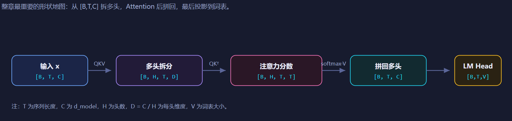
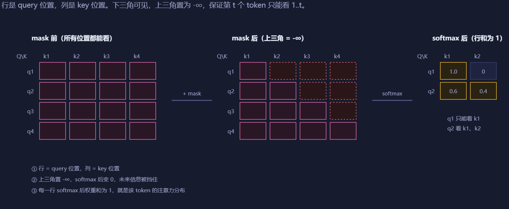
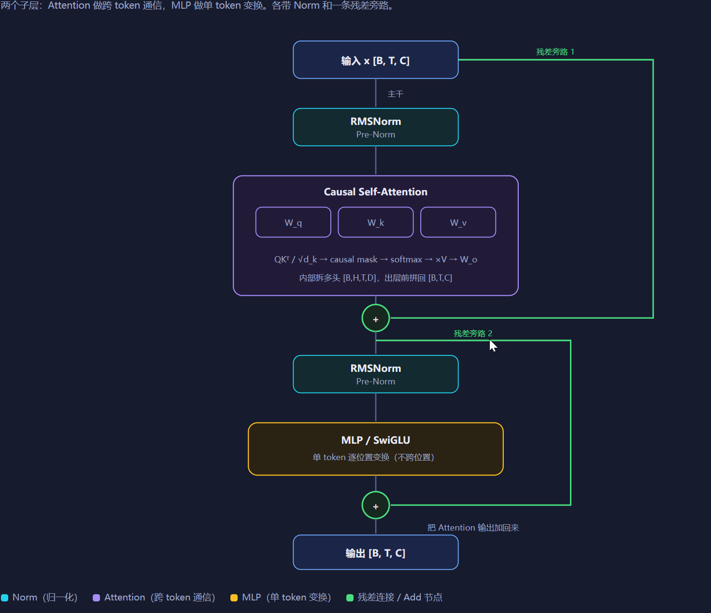
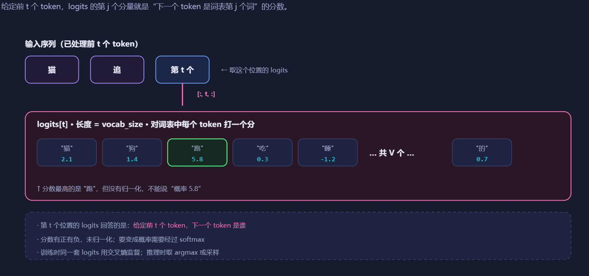
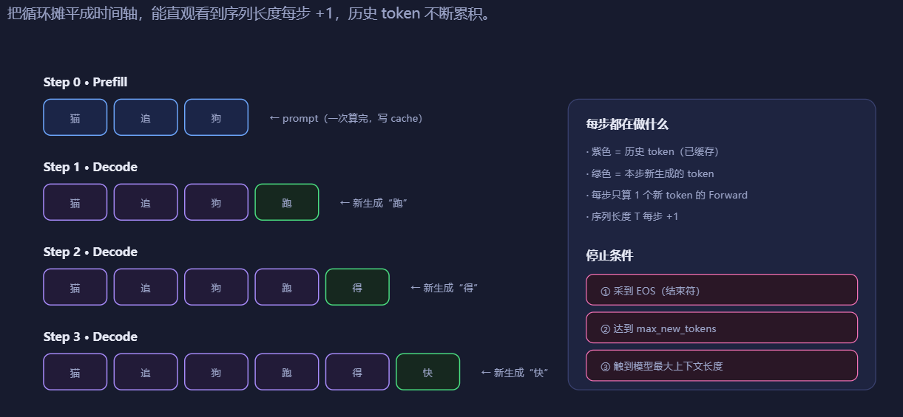

# 第 3 章 前向与生成

欢迎来到 zero-to-sglang 课程的第二部分第三章。本章将带你建立对大语言模型（Large Language Model, LLM）的**前向和生成涉及到的各种概念**，为后续深入学习 KV Cache 等推理优化技术打下基础。

## 1 本章学习目标

学习完本章后，你能够：

1. 能说清楚本章涉及到的各种**概念**。
2. 能说清一个 token 从输入表示，到 Forward Pass 产生 logits，再到采样变成下一个 token 的**完整概念链路**。
3. 能区分 Forward、Generation、Prefill、Decode、KV Cache 各自解决什么问题，以及它们为什么必须分开理解。

本章只讲**概念与数据流**，具体实现放在代码篇。读完后，你应当能在不写代码的情况下，深刻认识到前向与生成的全链路。

## 2 Forward Pass 核心：Attention、Block 与 Logits

### 2.1 从汉字到 embedding（tokenize/分词）

    

<em>图 1. Tokenize 与 Embedding</em>

一个汉字进入模型，第一步不是计算，是**翻译成一个向量**，这个过程需要用到 tokenizer。

**Tokenize（分词/词元化）**，简单说就是：**把一段文本切分成模型能处理的小单元（token），再把这些 token 转成数字 ID**。

可以理解成三步：

1. **原始文本**：`"我爱datawhale"`
2. **切分成 token**：可能变成 `["我", "爱", "datawhale"]`
3. **转成数字 ID**：比如 `[123, 456, 789]`

模型真正看到的不是文字，而是这些数字 ID。为什么需要 tokenize？因为神经网络只能处理数字，不能直接读字符串。tokenize 就是把人类文字转换成数字序列的过程。

常见方法有：

- **BPE**：字节对编码，把高频字符组合合并成子词。
- **WordPiece**：类似 BPE，常用于 BERT。
- **SentencePiece**：常用于多语言模型。

**tokenizer 只做映射**，把文字切成 token，再映射成整数 id。它不理解语义，不参与计算。

而**embedding 是一张查找表**，形状是 `[vocab_size, d_model]`。id=123 就去第 123 行取一个向量。这个向量就是模型内部对"我"这个 token 的**初始表示**。此时它还不含上下文信息，只是一个可学习的静态向量。一句话会变成一串 id，查表后变成 `[T, d_model]` 的矩阵；加 batch 维后是 `[B, T, d_model]`，从这一刻起，模型内部只处理向量，不再处理文字。

### 2.2 位置编码：让模型知道顺序

位置编码在第一部分的第一章有介绍，这里只做基础讲解。

Embedding 查表是**按 id 取行**，与位置无关。`"猫追狗"` 和 `"狗追猫"` 的 token 集合一样，但顺序不同，意思完全不同。

所以需要位置编码，把**第几个 token**这个信息注入向量。

常见的**RoPE（旋转位置编码）**不额外加向量，而是在 Attention 里对 Q/K 做旋转，让点积结果携带相对位置信息。这是现代 LLM 主流。

做完这一步，每个 token 的向量同时携带了**身份信息（是什么 token）**和**位置信息（在第几位）**。

### 2.3 Attention：token 之间开始通信

到目前为止，每个 token 的向量是独立的，互相不知道对方存在。Attention 是第一个让 token 之间交换信息的站。

输入向量首先经过**Q/K/V 投影**，把同一个输入向量投影到三个不同空间。Q 代表"我在找什么"，K 代表"我有什么"，V 代表"我实际传递什么"。

    

<em>图 2. Q/K/V 投影</em>

然后是**多头拆分**， 切成 H 个头，每个头独立做 Attention，最后拼回来。不同头就可以关注不同模式。

    

<em>图 3. 多头拆分</em>

    

<em>图 4. 多头注意力计算</em>

这里值得注意的是**Causal mask**，**把未来位置的分数设为负无穷**，保证第 t 个 token 只能看到 1 到 t，不能偷看后面。

    

<em>图 5. Causal Mask</em>

Attention 输出后，此时每个 token 的向量已经混入了它能看到的**所有历史 token 的信息**。这一步是 Forward Pass 里计算量最大的部分。

### 2.4 Transformer Block：Attention + MLP + 残差 + Norm

一个 Transformer Block 做两件事，第一件事是： 使用**Attention** 让 token 之间通信。第二件是： 经过MLP 让每个 token 自己消化信息。

结构（Pre-Norm）：

    

<em>图 6. Transformer Block 结构（Pre-Norm）</em>

**Attention 是跨 token 的**，做信息交换。**MLP 是单 token 的**，对每个位置独立做非线性变换，不跨位置。**残差**让梯度直通深层，模型可以堆很多层而不退化。现在的**Pre-Norm** 把 Norm 放在子层之前，训练更稳定，是现代 LLM 标配。而Norm 让每层输入分布稳定，避免激活爆炸或消失。

单单一个 Block 是不够的，所以我们要堆 N 层。N 层之后，每个 token 的向量已经经过了 N 轮信息交换和变换，变成了高度上下文化的表示。最后接一个 **final norm**，把输出稳定到统一尺度。

### 2.5 LM Head：从向量到 logits

Final norm 输出 `[B, T, d_model]`，但我们需要的是下一个** token 是什么**，这里用到的工具模块是 **LM Head**，全称 Language Modeling Head，是 decoder-only 大模型最顶部的输出头。它的核心作用是把 **Transformer 最后一层输出的隐藏状态映射到整个词表空间**，得到每个 token 的**未归一化分数 logits**，用来预测下一个 token。

LM Head 通常在最终 LayerNorm 之后。严格说，LM Head 一般就是一个线性层。

Logits 是模型最后一层输出的、未归一化的原始预测分数。**logits** 是每个位置对词表里每个 token 的原始打分。

    

<em>图 7. LM Head 与 Logits</em>

logits 并不是概率，它没有进行归一化。第 t 个位置的 logits 表示**给定前 t 个 token，下一个 token 是谁**的分数。训练时用所有位置的 logits 算交叉熵；推理时只取最后一个位置。

### 2.6 现代 LLM 中的常见结构变体

标准 Transformer Block 是基础，现代 LLM 常在 Attention、FFN/MLP、Norm、位置编码、KV Cache 等模块上做替换或优化。下表只做简单提及，不展开公式和实现。

| 模块 | 基础做法 | SOTA / 现代变体 | 简单说明 |
|---|---|---|---|
| FFN / MLP | 单个稠密 MLP | MoE（Mixture of Experts） | 多个专家 FFN，Router 为每个 token 选 top-k 专家；参数量大，但激活计算量可控 |
| Attention | MHA（多头注意力） | MQA / GQA | 多个 Query 头共享少量 Key/Value 头，减少 KV Cache 和显存带宽 |
| Norm | LayerNorm | RMSNorm | 去掉均值中心化，更简单，训练稳定 |
| Norm 位置 | Post-Norm | Pre-Norm | Norm 放在子层之前，深层训练更稳定 | 
| 位置编码 | 学习绝对位置 / 正弦编码 | RoPE | 在 Attention 中对 Q/K 做旋转，让点积携带相对位置信息 | 
| Attention 计算 | 标准 Attention | FlashAttention | IO 感知优化，减少显存访问，加速 Attention | 多数现代推理框架 |

这些变体不改变 Forward Pass 的本质：仍然是从 token 到 embedding，经过多层 Block，最后到 LM Head 和 logits。区别主要在于 Attention、FFN、Norm、位置编码和缓存管理这些模块用了更现代的实现。

## 3 Logits 到文本

大模型的 LM Head 输出的 logits 是对每个原始 token 的原始打分，从原始打分到大模型输出文字还有采样这道工序。大模型通过自回归一次一次地前向生成 logits、采样、选出 token、拼接到末尾，直到到达停止条件。

    

<em>图 8. 自回归生成循环</em>

### 3.1 为什么需要采样

LM Head 输出 logits，logits 不是最终答案。通常都是 logits 经过一个 softmax，这时候是一个概率分布，这时候按照策略选择一个 token 作为输出。

**选 token 的策略就是采样**。语言生成本身是开放的、多解的、概率性的任务，而不是确定性的映射。所以需要采样，不同的采样策略，大模型生成的效果也不一样。有时候，相同的提示词模型生成的结果不一样，可能就是采样的**随机性**造成的。

### 3.2 常见采样策略

#### 3.2.1 **Greedy（贪心）策略**

每步直接取概率最大的 token。确定性输出，适合事实问答，但容易重复、死板。

#### 3.2.2 **温度Temperature**

**温度**是大模型采样时最常用的一个超参数，用来控制生成随机性的强弱。它不改变模型本身，只在推理时对 logits 做缩放，从而改变下一个 token 的概率分布。

可以把 logits 看成模型给每个候选 token 打的"原始分"。Softmax 是把分数变成概率。温度则决定你多看重这些分数差异：

- **低温**：非常看重高分 token，低分 token 几乎没机会。
- **高温**：分数差异被抹平，低分 token 也有不小机会。

数学形式是模型输出 logits 后，温度 $T$ 会先除到 logits 上，再做 Softmax：

$$
p_i = \frac{\exp(\text{logit}_i / T)}{\sum_j \exp(\text{logit}_j / T)}
$$

- $T = 1$：原始分布，不缩放；
- $T < 1$：放大 logits 差异，分布更尖锐；
- $T > 1$：缩小 logits 差异，分布更平坦；
- $T \to 0$：退化为贪心，直接选概率最大的 token；
- $T \to \infty$：趋近均匀分布，几乎纯随机。

#### 3.2.3 Top-k 和 Top-p

**Top-k 和 Top-p 都是截断采样策略：在模型输出的概率分布中，只保留一部分候选 token，去掉长尾低概率 token，再重新归一化并采样。**
它们的作用是在"多样性"和"连贯性"之间做平衡，避免纯随机采样胡言乱语，也避免贪心搜索死板重复。

模型经过 Softmax 后，会给词表中每个 token 一个概率。但词表通常有几万到几十万 token，很多 token 概率极低但数量庞大。如果直接按完整分布采样，偶尔会抽到非常离谱的词，导致跑题、幻觉、不连贯。

所以需要**保留合理候选**，保留高概率 token；还要**截掉长尾噪声**，去掉低概率 token；还要**重新归一化**，在保留的候选里重新分配概率；然后**再采样**，按新分布选下一个 token。

Top-k 和 Top-p 就是两种最常用的截断方式。

Top-k 的做法很简单：只保留概率最高的 $k$ 个 token，其余全部丢弃，然后在这 $k$ 个 token 中重新归一化并采样。

Top-p 不固定候选数量，而是动态选择：按概率从高到低排序，保留累计概率刚好达到 $p$ 的最小 token 集合，然后重新归一化并采样。

也就是说，候选集合的大小由概率分布的形状决定。

#### 3.2.4 策略总结

| 名称 | 作用层级 | 改变什么 | 是否随机 | 极端/等价关系 |
|---|---|---|---|---|
| Greedy | 最终选择规则 | 直接选 argmax | 否 | 可看作 top-k=1，或 T→0 |
| Temperature | 分布调节 | 放大/缩小 logits 差异 | 间接影响 | T=1 原始；T<1 更确定；T>1 更随机；T→0 贪心 |
| Top-k | 候选截断 | 固定保留前 k 个 token | 之后可采样 | k=1 等价贪心；k=词表大小等于不截断 |
| Top-p | 候选截断 | 动态保留累计概率到 p 的最小集合 | 之后可采样 | p=1 不截断；p 很小时近似贪心 |

### 3.3 自回归生成循环

生成不是一次完成，是循环。大模型自回归生成，本质就是：

**根据已有 token 预测下一个 token，把新 token 追加到已有序列后面，再用更新后的序列继续预测下一个 token，如此循环。**

每一步都只依赖当前及之前的 token，不能看到未来。模型通过因果掩码保证这一点。

训练时，因为真实答案已知，可以并行计算所有位置的预测；推理时，下一个 token 必须由模型自己生成，所以只能串行地一个一个往外吐。

直到遇到结束符、达到最大长度或命中停止条件，循环结束。

    

<em>图 9. 生成循环示意</em>

到达停止条件后停止生成，停止条件有：

1. 采到 EOS。
2. 达到 max_new_tokens。
3. 达到模型最大上下文长度。

## 4 Prefill、Decode 与 KV Cache

Prefill、Decode 在第一部分的推理章节就有详细讲解，这里简单介绍，连贯内容和对接代码，KV Cache 在后面有详细介绍，这里也只会简单介绍概念。

Prefill 和 Decode 并不是两个不同的模型，而是同一个自回归生成循环中的两个阶段。理解它们，关键要抓住一点：**哪些 token 已经知道，哪些 token 必须等模型自己生成。**

### 4.1 Prefill：一次处理完整提示词

Prefill 发生在生成第一个新 token 之前。此时输入是完整的提示词，或者更一般地说，是当前已经确定的整个上下文。因为这段**上下文的所有 token 都是已知的**，模型不需要**一个 token 一个 token 地算**，而是可以把整段序列一次性送进 Transformer，并行计算每个位置的隐藏状态。

在因果掩码的作用下，每个位置仍然只能看到自己和之前的 token，不能看到未来。**但因为所有位置同时进入模型，矩阵计算可以高度并行，GPU 利用率较高**。Prefill 结束后，模型取最后一个位置的输出，经过 LM Head 得到 logits，再经过采样得到第一个新 token。

所以 Prefill 的任务可以概括为三件事：

1. 并行处理完整提示词；
2. 建立后续生成要用的 KV Cache；
3. 产出第一个新 token。

它决定了用户从发出请求到看到第一个 token 的延迟，也就是常说的首 token 延迟。

### 4.2 Decode：逐 token 串行生成

Decode 发生在 Prefill 之后。此时第一个新 token 已经产生，接下来要生成第二个、第三个，直到停止。问题在于，下一个 token 依赖刚刚生成的 token，而刚刚生成的 token 又依赖再上一个，因此无法像 Prefill 那样一次并行算出所有未来 token。

于是生成过程变成串行循环：

- 把上一步新生成的 token 作为当前输入；
- 模型结合之前缓存的历史信息，计算当前 token 的隐藏状态；
- 经过 LM Head 得到新的 logits；
- 采样出下一个 token；
- 把它追加到序列末尾；
- 继续下一步。

Decode 阶段每一步只处理一个新 token，计算量看起来不大，但它必须重复很多次。它决定了每个输出 token 的平均延迟，也直接影响生成速度和吞吐。

### 4.3 Prefill 与 Decode 的核心区别

Prefill 和 Decode 最大的区别在于**输入长度和并行性**。

Prefill 的输入是整段提示词，长度可能几百、几千甚至几万 token，所有位置可以并行计算，因此更像训练时的前向传播，**通常是计算密集型，瓶颈在 GPU 算力**。

Decode 的输入通常只有一个新 token，但每一步都要读取模型权重和之前缓存的历史信息。它的实际计算量相对小，**却要频繁访问显存，因此通常是显存带宽密集型，瓶颈在数据搬运，而不是纯计算**。

从生成循环看：

- Prefill 只发生一次；
- Decode 会发生多次，直到遇到结束符、达到最大长度或命中停止条件。

后续代码中通常也能看到这种结构：第一次前向传入完整提示词，得到第一个 token 和缓存；之后进入循环，每次只传入上一个 token 和缓存，得到下一个 token。这个"第一次"和"之后的循环"，对应的就是 Prefill 和 Decode。

### 4.4 KV Cache 为什么让生成变快

要理解 KV Cache，先要回到自注意力本身。在 Transformer 的注意力计算中，每个 token 都会产生 Query、Key、Value 三种表示。对当前新 token 来说，它的 Query 需要和所有历史 token 的 Key 计算注意力权重，再对这些历史 token 的 Value 加权求和。

**历史 token 的 Key 和 Value 只取决于它们自己的表示和模型权重，不会因为后面生成了新 token 而改变。** 也就是说，一旦某个 token 的 Key 和 Value 算出来了，它们在后续步骤中就可以重复使用。

如果没有 KV Cache，每生成一个新 token，模型都要把整个前缀重新送进网络，重新计算所有历史 token 的 Key 和 Value。历史越长，重复计算越多。生成第 100 个 token 时，前 99 个 token 的很多计算其实早已做过，却还要再做一遍。

有了 KV Cache，情况就不同了：

- Prefill 阶段一次性算出提示词中所有 token 的 Key 和 Value，并按层保存起来；
- Decode 阶段每生成一个新 token，只计算这个新 token 自己的 Query、Key、Value；
- 新的 Key 和 Value 追加到缓存中；
- 新的 Query 直接读取缓存里的全部历史 Key 和 Value，完成注意力计算。

这样，每一步都只需要处理"新增的一个 token"，而不是重新处理整个序列。历史 token 的 Key 和 Value 不再重复计算，节省了大量矩阵运算。序列越长，这种节省越明显，所以 KV Cache 是自回归生成能够实用的关键。

但 KV Cache 也不是免费的。它会占用大量显存，大小随层数、注意力头数、序列长度和批大小增长。长上下文生成时，KV Cache 往往成为显存占用的主要部分。同时，Decode 每步都要读取缓存，显存带宽也可能成为瓶颈。**因此后续才会出现分页式显存管理、量化缓存、分组查询注意力等优化。**

## 5 常见概念总结

**Hidden State（隐藏状态）**
Transformer 每一层输出的向量表示，形状通常是 B×T×d_model。经过多层后，它从只包含 token 身份的静态向量，变成包含上下文的动态表示。

**Causal Mask（因果掩码）**
把未来位置的注意力分数设为负无穷，保证第 t 个 token 只能看到第 1 到第 t 个 token，不能偷看后面。它是自回归生成在模型结构上的保证。

**MLP / FFN**
前馈网络，对每个 token 位置独立做非线性变换，不跨位置通信。它负责让每个 token 自己消化 Attention 收集来的信息。

**LM Head（语言模型输出头）**
模型最顶部的线性层，把 Final Norm 输出的隐藏状态映射到词表空间，得到每个 token 的 logits。它解决"隐藏状态如何变成词表打分"的问题。

**Logits**
LM Head 输出的未归一化原始分数。每个位置都有一个长度为 vocab_size 的 logits 向量，表示模型认为下一个 token 是词表中每个 token 的得分。logits 不是概率，可以为负，也不求和为 1。

**Softmax**
把 logits 变成概率分布的函数。经过 Softmax 后，每个值非负，且总和为 1。此时才表示"下一个 token 是各候选词的概率"。

**采样**
从概率分布中选出下一个 token 的过程。语言生成本身是开放、多解、概率性的任务，所以需要采样，而不是永远取唯一答案。

**停止条件**
生成循环结束的条件。常见包括：采到 EOS、达到 max_new_tokens、达到模型最大上下文长度、命中自定义停止字符串、结构化输出完成、外部中断。

**EOS**
End of Sequence，结束 token。模型生成它通常表示回答结束。

**max_new_tokens**
本次生成最多允许产生的新 token 数量。达到后强制停止。

**最大上下文长度**
模型一次能处理的最大 token 数，包括 prompt 和已生成 token。超过后通常需要截断、滑窗或特殊长上下文策略。

**首 token 延迟（TTFT）**
从请求发出到看到第一个输出 token 的时间。主要受 Prefill 影响。

**每 token 延迟 / TPOT / ITL**
生成阶段每个新 token 的平均耗时。主要受 Decode 影响。

## 6 总结与测试题

### 6.1 课程总结

本章围绕"一个 token 如何进入模型、如何被生成出来"这条主线，建立了从文本到 logits、再到下一个 token 的完整概念链路：

1. **前向链路**：原始文本 → tokenizer 切分并映射为 token id → embedding 查表得到 `[B, T, d_model]` → 位置编码注入顺序信息 → N 层 Transformer Block → final norm → LM Head → logits。
2. **Attention 与 Block**：Attention 通过 Q/K/V、多头拆分、Causal Mask 让 token 之间交换信息，是跨 token 通信；MLP 对每个位置独立做非线性变换，不跨位置；残差和 Pre-Norm 保证深层网络稳定训练。
3. **Logits 到文本**：logits 是未归一化原始分数，不是概率；经 Softmax 变成概率分布后，通过采样策略（Greedy、Temperature、Top-k、Top-p）选出下一个 token，再追加到序列末尾，进入自回归循环。
4. **Prefill 与 Decode**：二者是同一个生成循环中的两个阶段，Prefill 并行处理完整提示词并建立 KV Cache，Decode 逐 token 串行生成；KV Cache 通过缓存历史 Key/Value，避免了每步都重新计算整段历史。

### 6.2 测试题

1. 请描述一个 token 从输入表示，到 Forward Pass 产生 logits，再到采样变成下一个 token 的完整概念链路。
2. Logits 和概率分布有什么区别？为什么推理时需要采样，而不是直接取 logits 最大值？Temperature、Top-k、Top-p 分别如何影响生成？
3. Prefill 和 Decode 阶段的核心区别是什么？为什么 Prefill 通常是计算密集型，而 Decode 通常是显存带宽密集型？

## 参考资料

- [Attention Is All You Need](https://arxiv.org/abs/1706.03762)
- [RoFormer: Enhanced Transformer with Rotary Position Embedding](https://arxiv.org/abs/2104.09864)
