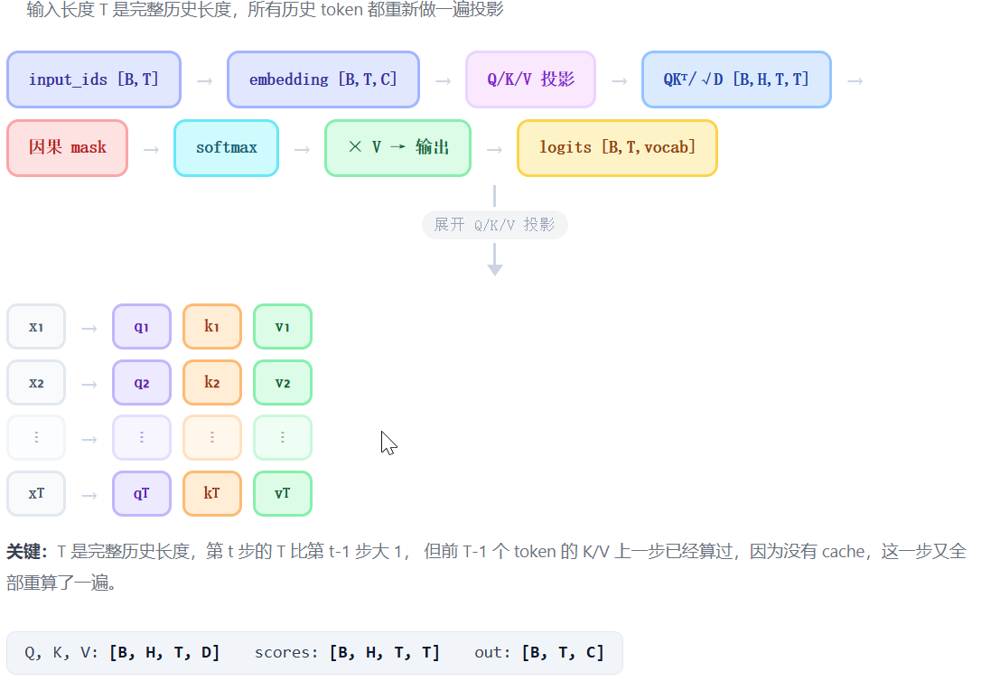
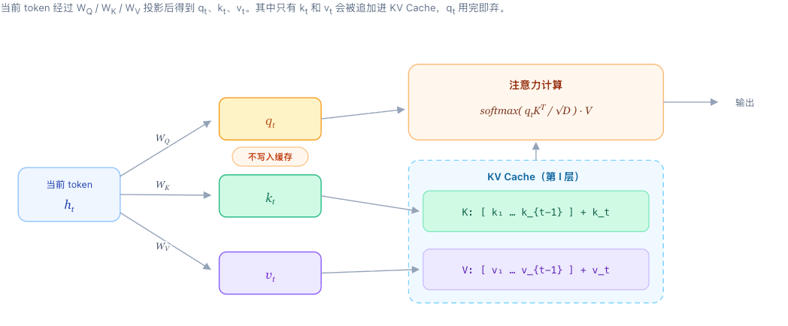
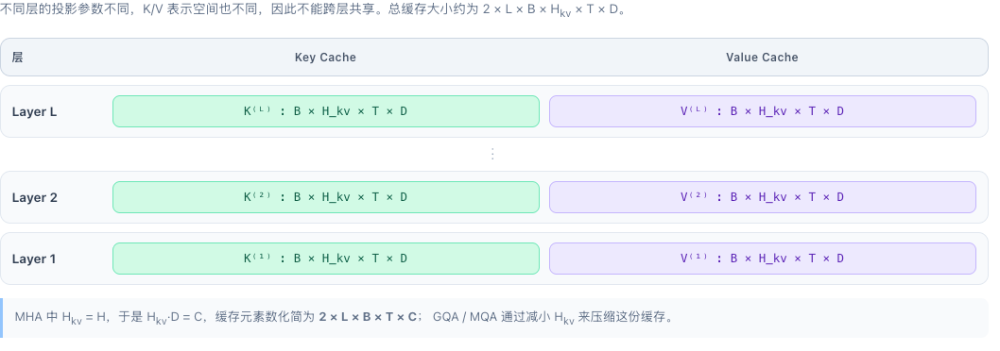
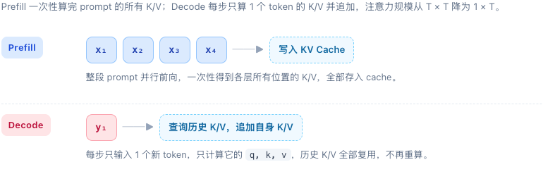

# 第 4 章 KV Cache 优化

在上一章中，我们把自回归生成拆成了 Prefill 与 Decode 两个阶段，并看到模型会逐 token 生成文本。本章进一步解释推理系统最基础也最关键的一项优化：KV Cache。它通过保存历史 token 在每层注意力中的 Key 和 Value，避免 Decode 阶段反复计算已经得到的结果，使长序列生成成为可能。

本章先从没有 KV Cache 时的重复计算出发，再说明缓存的对象、读写方式与复杂度收益。下一章将在此基础上，把生成能力封装成可通过 HTTP 调用的服务。

## 1 本章学习目标

完成本章学习后，你将能够：

1. **解释无 KV Cache 时重复计算的根源**：从自回归生成的循环过程出发，说明为什么每一步都需要把完整历史重新送入模型，以及历史 token 的 K/V 为什么会被反复投影和重新参与注意力计算。

2. **描述 KV Cache 的核心思想与缓存对象**：说清楚 KV Cache 缓存的是每一层 self-attention 中历史 token 经过 K/V 线性投影后得到的张量，而不是 Query、attention 矩阵、logits 或完整 hidden state。

3. **推导 KV Cache 的复杂度收益**：分别从 K/V 投影和注意力矩阵两个口径出发，推导无 Cache 时的 $O(n^2)$ 与 $O(n^3)$，以及有 Cache 后 K/V 投影降到 $O(n)$、单步注意力从 $O(T^2)$ 降到 $O(T)$ 的过程。

4. **区分 Prefill 与 Decode 两个阶段**：说明 Prefill 阶段如何一次性计算并写入 prompt 的全部 K/V，Decode 阶段如何每步只计算一个新 token 的 K/V 并追加到缓存。

## 2 没有 KV Cache 会重复计算

在自回归语言模型的生成过程中，模型每次只预测下一个 token，然后把新生成的 token 拼接到输入序列末尾，再预测下一个，如此反复。这个过程中，如果没有 KV Cache，模型会不记得上一步计算过什么，每一次预测都必须把迄今为止的完整历史重新送进网络，从头算一遍。

这意味着，生成第 1 个 token 时，模型处理的是整个 prompt；生成第 2 个 token 时，模型处理的是 prompt 加上第 1 个生成结果；生成第 3 个 token 时，输入又长了一截。每一步的输入都在变长，而模型对其中每一个历史 token 都要重新做投影、重新算注意力。这种重复计算，正是无 KV Cache 时效率低下的根源。

### 2.1 一步一重算：无 KV Cache 的生成循环

    

<em>图 1. 无 KV Cache 的生成循环</em>

假设 prompt 是 $x_1,x_2,\ldots,x_p$，我们想生成 $n$ 个新 token。无 KV Cache 的生成循环是这样的：

第一步，把整个 prompt 送入模型，得到第一个新 token $y_1$；

第二步，把 prompt 和 $y_1$ 拼在一起，再次送入模型，得到 $y_2$；

第三步，把 prompt、$y_1$、$y_2$ 拼在一起，又送入模型，得到 $y_3$……依此类推，直到生成第 $n$ 个 token。

在代码层面，这个循环通常写成：每次调用 `model(input_ids)`，其中 `input_ids` 是当前完整的序列。模型返回所有位置的 logits，但我们只关心最后一个位置，因为只有它才代表下一个 token”的预测。取出最后一个位置的 logits，采样或取 argmax，得到新 token，然后把它拼到序列末尾，进入下一轮。

输入是整个历史序列，而不是只输入新 token。模型会对所有 token 做前向计算，尽管我们只需要最后一个位置的输出。前面的历史 token 被一遍又一遍地重新计算，它们的 Key 和 Value 明明没有变化，却因为没有被保存下来，每次都要重新算一遍。

### 2.2 浪费在哪里：历史 K/V 被反复投影

    

<em>图 2. 历史 K/V 的重复投影</em>

为了看清浪费发生在哪里，我们来看单步内部的计算。假设第 $t$ 步输入序列长度为 $T$，输入形状是 $B \times T$（$B$ 是 batch size）。经过 embedding 后，张量变成 $B \times T \times C$（$C$ 是隐藏维度）。然后进入每一层 Transformer Block。

在注意力层里，模型首先对所有 $T$ 个位置做线性投影，得到 Query、Key、Value。它们的形状都是 $B \times H \times T \times D$，其中 $H$ 是注意力头数，$D$ 是每个头的维度。注意，这里的 $T$ 是完整历史长度，所以所有历史 token 都重新做了 $Q$、$K$、$V$ 投影。

接着计算注意力分数：Query 与 Key 的转置相乘，再除以 $\sqrt{D}$，得到一个 $B \times H \times T \times T$ 的矩阵。这个矩阵的每个元素代表某个 query 位置与某个 key 位置之间的关联强度。然后加上因果 mask，确保第 $i$ 个 query 只能看到位置 $j \le i$ 的 key，也就是不能偷看”未来的 token。mask 之后做 softmax，再与 Value 相乘，得到注意力输出。之后经过输出投影、残差连接、LayerNorm、MLP，继续下一层。

整个过程中，$T$ 是完整历史长度。第 $t$ 步的 $T$ 比第 $t-1$ 步的 $T$ 大 1，但前 $T-1$ 个 token 的 $K/V$ 在第 $t-1$ 步已经算过了。因为没有 cache，它们在第 $t$ 步又被重新投影、重新参与注意力分数的计算。这就是重复劳动。

### 2.3 一个小例子：从 [x₁, x₂] 到 [x₁, x₂, y₁, y₂]

    

<em>图 3. 无 KV Cache 的生成示例</em>

假设 prompt 只有两个 token：$x_1$ 和 $x_2$。我们想生成三个新 token。

第一步，输入是 $[x_1,x_2]$，长度为 2。模型计算所有位置的 $Q$、$K$、$V$，注意力分数矩阵是 $2 \times 2$。取最后一个位置的 logits，采样得到 $y_1$。

第二步，输入变成 $[x_1,x_2,y_1]$，长度为 3。模型重新计算 $x_1$ 的 $K/V$、$x_2$ 的 $K/V$，以及新加入的 $y_1$ 的 $K/V$。注意力分数矩阵变成 $3 \times 3$。取最后一个位置的 logits，得到 $y_2$。

第三步，输入变成 $[x_1,x_2,y_1,y_2]$，长度为 4。模型又从头计算 $x_1$、$x_2$、$y_1$、$y_2$ 的 $K/V$，注意力分数矩阵变成 $4 \times 4$。取最后一个位置的 logits，得到 $y_3$。

可以看到，$x_1$ 和 $x_2$ 的 $K/V$ 在第一步已经算过，但第二步、第三步又各算了一遍。$y_1$ 的 $K/V$ 在第二步算过，第三步又算了一遍。每一步的输入都在变长，每一步的注意力矩阵都从 $T \times T$ 重新计算，历史 token 的 $K/V$ 从未被复用。

### 2.4 重复量级：O(n²) 还是 O(n³)？

    

<em>图 4. 重复计算的复杂度</em>

这种重复计算的量是可以量化的。如果只看历史 token 的 $K/V$ 投影，第 1 步算了 1 个 token 的 $K/V$，第 2 步算了 2 个，第 3 步算了 3 个……第 $n$ 步算了 $n$ 个。总重复构造量是

$$
1+2+3+\cdots+n=\sum_{t=1}^{n}t=O(n^2).
$$

这就是很多人说无 KV Cache 是 $O(n^2)$”的来源之一。

如果看每一步完整的 $QK^\top$ 矩阵元素总数，第 $t$ 步的矩阵是 $t \times t$，累计起来是

$$
1^2+2^2+\cdots+n^2=\sum_{t=1}^{n}t^2=O(n^3).
$$

所以不同口径下会看到 $O(n^2)$ 或 $O(n^3)$ 的说法。通常标题里说的从 $O(n^2)$ 到 $O(n)$”，是在强调 decode 单步不再重算完整历史，而是当前 query 只查历史 cache，单步注意力从 $T \times T$ 变成 $1 \times T$。

但无论哪种口径，核心问题都是一样的：历史 token 的 $K/V$ 本来可以复用，却因为没有保存而每步重算。模型 forward 是无状态的，你给它什么输入，它就从头算什么，不会记得上一步算过什么。

## 3 核心思想：KV Cache 到底缓存了什么

一句话概括：KV Cache 缓存的是，在自回归生成过程中，每一层 self-attention 里所有历史 token 经过 Key/Value 线性投影后得到的 $K$ 和 $V$ 张量。它不缓存 Query，不缓存原始 token，也不缓存 logits。它的作用是让当前 token 只计算自己的 Query，然后直接查询历史 token 已经算好的 Key/Value。

### 3.1 从单步公式看KV Cache 到底缓存了什么

    

<em>图 5. KV Cache 的工作原理</em>

设当前处理的是第 $l$ 层、第 $t$ 步。当前 token 在这一层的输入隐藏状态记作 $h_t^{(l-1)}$。进入注意力层后，模型会用三组线性投影把它分别变成 Query、Key 和 Value：

$$
q_t^{(l)} = h_t^{(l-1)} W_Q^{(l)},\quad
k_t^{(l)} = h_t^{(l-1)} W_K^{(l)},\quad
v_t^{(l)} = h_t^{(l-1)} W_V^{(l)}.
$$

可以这样理解：Query 是当前 token 想查什么”，Key 是每个位置能提供什么索引”，Value 是每个位置实际携带的信息”。

在生成当前 token 之前，缓存中已经保存了此前所有历史 token 在同一层的 Key 和 Value：

$$
\mathcal{K}_{t-1}^{(l)} = [k_1^{(l)}, k_2^{(l)}, \ldots, k_{t-1}^{(l)}],
\quad
\mathcal{V}_{t-1}^{(l)} = [v_1^{(l)}, v_2^{(l)}, \ldots, v_{t-1}^{(l)}].
$$

注意，缓存保存的不是原始 token，也不是完整的隐藏状态，而是历史 token 经过本层 K/V 投影之后得到的结果。并且，每一层都有自己的缓存，层与层之间不能共用。

当前 token 到来后，模型只需要计算它自己的 $q_t^{(l)}, k_t^{(l)}, v_t^{(l)}$，不需要把历史 token 重新送进网络。新的 Key 和 Value 会被追加到本层缓存的末尾：

$$
\mathcal{K}_t^{(l)} = [\mathcal{K}_{t-1}^{(l)}; k_t^{(l)}],
\quad
\mathcal{V}_t^{(l)} = [\mathcal{V}_{t-1}^{(l)}; v_t^{(l)}].
$$

缓存中已有的历史部分保持不变，于是缓存从前 $t-1$ 个 token 的 K/V”扩展成前 $t$ 个 token 的 K/V”。

接下来，当前 token 用自己的 Query 去查询更新后的整个 Key 缓存，得到它对各个历史位置的注意力权重；再用这些权重对 Value 缓存做加权求和，得到当前 token 在本层的注意力输出：

$$
o_t^{(l)}
=
\operatorname{softmax}
\left(
\frac{
q_t^{(l)} \left(\mathcal{K}_t^{(l)}\right)^\top
}{
\sqrt{D}
}
\right)
\mathcal{V}_t^{(l)}.
$$

之后继续经过输出投影、残差连接、LayerNorm 和 MLP，进入下一层。

如果是多头注意力，每个头都会独立做一遍同样的事：各自计算 Query、Key、Value，各自维护自己的 K/V 缓存，各自计算注意力。最后把所有头的输出拼接起来，再做一次输出投影。

所以最关键的区别是：Query 只服务于当前这一步，算完就不需要了，因此不缓存；Key 和 Value 会被后续每一步反复查询，因此必须缓存。KV Cache 缓存的是每一层、每个 KV 头在历史位置上已经算好的 K 和 V，而不是 attention 矩阵，也不是 logits，更不是完整的 hidden state。

### 3.2 缓存的是每层、每个 KV 头的 K/V

    

<em>图 6. 分层 KV Cache</em>

KV Cache 不是一份全局缓存，而是每一层 Transformer Block 都有自己的缓存。也就是说，如果模型有 $L$ 层，那么缓存里实际保存的是：

$$
\text{Layer }1:\quad K^{(1)},V^{(1)},
$$

$$
\text{Layer }2:\quad K^{(2)},V^{(2)},
$$

$$
\cdots
$$

$$
\text{Layer }L:\quad K^{(L)},V^{(L)}.
$$

不同层的 K/V 不能共享，因为每一层的注意力参数 $W_Q^{(l)},W_K^{(l)},W_V^{(l)}$ 不同，得到的表示空间也不同。

对于第 $l$ 层，假设有 $H_{kv}$ 个 KV 头，每个头维度为 $D$，batch size 为 $B$，当前序列长度为 $T$，则 Key 和 Value 的形状通常为：

$$
K^{(l)},V^{(l)} \in \mathbb{R}^{B \times H_{kv} \times T \times D}.
$$

因此，所有层的 KV Cache 元素总数约为：

$$
2 \times L \times B \times H_{kv} \times T \times D.
$$

如果使用标准多头注意力 MHA，并且 $H_{kv}=H$、$D=C/H$，则 $H_{kv}D=C$，于是总元素数可以简化为：

$$
2 \times L \times B \times T \times C.
$$

如果使用 GQA 或 MQA，$H_{kv}$ 小于 Query 头数 $H$，所以 KV Cache 会显著变小。这也是后续优化 KV Cache 显存占用的重要方向之一。

若每个元素占 $\text{dtype\_bytes}$ 字节，则 KV Cache 的显存占用为：

$$
2 \times L \times B \times H_{kv} \times T \times D \times \text{dtype\_bytes}.
$$

例如 FP16 下，$\text{dtype\_bytes}=2$。

### 3.3 为什么只缓存 K/V，不缓存 Q？

因为注意力的计算方向是：当前 token 的 Query 去查询历史 token 的 Key，并从历史 token 的 Value 中取信息。

在 decode 阶段：

- 当前 token 需要自己的 Query；
- 当前 token 需要历史 token 的 Key，用来计算注意力权重；
- 当前 token 需要历史 token 的 Value，用来加权求和；
- 历史 token 的 Query 在后续生成中不再需要。

历史 token 的 Query 只在该 token 作为当前查询者”时有用。它当时已经完成了自己的注意力计算，并生成了对应的输出。后续 token 不会再回头使用历史 Query。因此缓存 Query 没有收益，反而会增加显存和带宽开销。

这也是 KV Cache 这个名字的来源：只缓存 Key 和 Value。

### 3.4 有 KV Cache 时的生成流程

有 KV Cache 后，生成过程分为两个阶段。

    

<em>图 7. Prefill 与 Decode 的 KV Cache 流程</em>

**Prefill 阶段**：把完整 prompt 一次性送入模型。模型计算 prompt 中所有 token 在每一层的 K/V，并保存到 cache 中。同时得到第一个新 token。

**Decode 阶段**：之后每次只输入一个新 token。模型不再重新计算历史 token 的 K/V，而是：

1. 计算当前 token 在每一层的 $q_t,k_t,v_t$；
2. 把当前层的 $k_t,v_t$ 追加到该层 cache 末尾；
3. 用当前层的 $q_t$ 与更新后的 $K$ cache 计算注意力分数；
4. 用注意力分数对 $V$ cache 加权求和；
5. 得到当前 token 的输出，继续往上层计算；
6. 最终得到下一个 token 的 logits，采样后进入下一轮。

因此，decode 单步中，注意力不再需要计算完整历史长度的 $T \times T$ 矩阵，而是变成当前 Query 对历史 Key 的 $1 \times T$ 注意力。历史 token 的 K/V 被真正复用了。

### 3.5 常见误解

KV Cache 不是缓存整个序列的 hidden state。它缓存的是每一层注意力内部的 Key 和 Value 投影结果。

KV Cache 不是所有层共享一份。每一层都有自己的 K/V cache。

KV Cache 不是缓存 attention 矩阵。注意力权重是每一步临时算出来的，不会被保存。

KV Cache 不是缓存 logits。logits 只在最后一层产生，并且只用于当前步采样。

KV Cache 不是只缓存最后一层。恰恰相反，每一层 self-attention 都需要自己的 K/V cache。

如果使用 RoPE，Key 通常是在应用旋转位置编码之后被缓存；Query 在当前步应用旋转后使用。Value 一般不做位置旋转。

KV Cache 的本质，是把历史 token 在各层注意力中的 Key 和 Value”保存下来，避免每一步重新计算完整历史。这样，模型 forward 虽然仍然是无状态的，但推理系统可以通过外部缓存，把历史计算结果的复用起来。

没有 KV Cache 时，第 $t$ 步要重新计算 $1$ 到 $t$ 所有 token 的 K/V；有 KV Cache 后，第 $t$ 步只需要计算当前 token 的 K/V，然后追加到 cache。单步注意力的计算从 $T \times T$ 降为 $1 \times T$，这就是 KV Cache 最核心的优化思想。

## 4 复杂度推导：从 O(n²) 到 O(n)

这一节只关注序列长度带来的复杂度变化。为简化，忽略层数 $L$、隐藏维度 $d$、注意力头数 $H$ 等常数，只看 token 数量对计算量的影响。

设 prompt 长度为 $p$，要生成 $n$ 个新 token。第 $t$ 个 decode 步时，序列总长度为

$$
T_t = p + t.
$$

为突出主要矛盾，下面假设 $p$ 固定，$n$ 为主要变量，因此 $T_t$ 与 $n$ 同阶。

### 4.1 无 KV Cache：历史 K/V 每步重算

没有 KV Cache 时，第 $t$ 步必须把完整历史重新送入模型。也就是说，模型要对所有 $T_t$ 个 token 重新做 Q/K/V 投影。

只看 K/V 投影，第 $t$ 步的计算量对序列长度是

$$
O(T_t).
$$

生成 $n$ 个 token 的总 K/V 投影量为

$$
\sum_{t=1}^{n} O(T_t)
=
O\left(\sum_{t=1}^{n} (p+t)\right)
=
O\left(np + \frac{n(n+1)}{2}\right)
=
O(n^2).
$$

这就是无 KV Cache 是 $O(n^2)$”的一个来源：历史 token 的 K/V 本来可以复用，却每一步都重新投影了一遍。

如果再看注意力分数矩阵，第 $t$ 步的矩阵大小是 $T_t \times T_t$，元素数量为

$$
T_t^2.
$$

累计到 $n$ 步：

$$
\sum_{t=1}^{n} T_t^2
=
\sum_{t=1}^{n} (p+t)^2
=
O(n^3).
$$

所以从完整注意力矩阵的角度看，无 KV Cache 的总量级是 $O(n^3)$。单步看，第 $t$ 步注意力复杂度是

$$
O(T_t^2).
$$

### 4.2 有 KV Cache：历史 K/V 只算一次

有 KV Cache 后，生成分为两个阶段。

Prefill 阶段，prompt 一次性送入模型，计算所有 prompt token 的 K/V 并写入缓存。之后进入 Decode 阶段，每一步只输入一个新 token。

第 $t$ 步 decode 时，模型只需要计算当前 token 的 $q_t,k_t,v_t$。其中 K/V 投影只作用在 1 个 token 上，因此对序列长度的复杂度是

$$
O(1).
$$

生成 $n$ 个 token 的总 K/V 投影量为

$$
\sum_{t=1}^{n} O(1) = O(n).
$$

于是，K/V 投影这部分从无 Cache 的 $O(n^2)$ 降到了有 Cache 的 $O(n)$。

再看注意力。当前 token 只需要用自己的 Query 去查询历史 Key 缓存，历史长度为 $T_t$。因此第 $t$ 步的注意力分数向量长度是 $T_t$，计算量对序列长度是

$$
O(T_t).
$$

累计 $n$ 步：

$$
\sum_{t=1}^{n} O(T_t)
=
O\left(\sum_{t=1}^{n} (p+t)\right)
=
O(n^2).
$$

单步注意力则从无 Cache 的

$$
O(T_t^2)
$$

降为

$$
O(T_t).
$$

### 4.3 复杂度对比

| 口径 | 无 KV Cache | 有 KV Cache |
|---|---|---|
| 单步 K/V 投影 | $O(T)$ | $O(1)$ |
| $n$ 步累计 K/V 投影 | $O(n^2)$ | $O(n)$ |
| 单步注意力 | $O(T^2)$ | $O(T)$ |
| $n$ 步累计注意力 | $O(n^3)$ | $O(n^2)$ |
| 缓存显存 | $0$ | $O(T)$ |

如果考虑隐藏维度 $d$，注意力可写成 $O(T^2 d)$ 和 $O(T d)$，投影可写成 $O(T d^2)$ 和 $O(d^2)$。但主变量仍然是序列长度，因此通常简写为上面的形式。

### 4.4 从 O(n²) 到 O(n)

这里说的从 $O(n^2)$ 到 $O(n)$”，通常指生成 $n$ 个 token 时，历史 token 的 K/V 投影不再每一步重算：

$$
\text{无 Cache：}\sum_{t=1}^{n} T_t = O(n^2),
$$

$$
\text{有 Cache：}\sum_{t=1}^{n} 1 = O(n).
$$

这是 KV Cache 最直接的收益。

但要强调，注意力本身仍要与历史交互。当前 token 必须查询所有历史 Key，所以单步是 $O(T)$，累计 $n$ 步仍然是

$$
O(n^2).
$$

因此，降到 $O(n)$”不是说整个推理都变成线性，而是说被缓存消除的那部分重复 K/V 计算降到了线性。完整 attention 的累计复杂度仍然是 $O(n^2)$，除非进一步使用滑窗注意力、稀疏注意力或线性注意力等优化。

### 4.5 包含 Prefill 的总复杂度

若把 prompt 也计入，有 KV Cache 的完整生成过程大致是：

- Prefill：注意力 $O(p^2)$，K/V 投影与缓存 $O(p)$；
- Decode：注意力 $O(n^2)$，K/V 投影 $O(n)$。

总注意力约为

$$
O((p+n)^2),
$$

总 K/V 投影约为

$$
O(p+n).
$$

无 KV Cache 时，总注意力约为

$$
O((p+n)^3),
$$

总 K/V 投影约为

$$
O((p+n)^2).
$$

所以，KV Cache 的核心复杂度收益可以概括为：

$$
\text{历史 K/V 重复投影：} O(n^2) \rightarrow O(n),
$$

$$
\text{单步注意力：} O(T^2) \rightarrow O(T).
$$

而 decode 逐 token 查询历史所带来的累计注意力成本，仍然是 $O(n^2)$。这就是从 $O(n^2)$ 到 $O(n)$ 的准确含义。

## 5 总结与测试题

### 5.1 课程总结

本章围绕 KV Cache 如何消除自回归生成中的重复计算，建立了以下关键认识：

1. **无 Cache 的问题**：每生成一个 token，模型都会重新处理完整历史，历史 token 的 K/V 投影累计为 $O(n^2)$，完整注意力矩阵的累计计算则为 $O(n^3)$。
2. **缓存的对象**：KV Cache 按层保存历史 token 经 Key、Value 投影后的结果；Query 只服务于当前步骤，历史 Query 不会被后续 token 使用，因此无需缓存。
3. **Prefill 与 Decode**：Prefill 一次性计算 prompt 的全部 K/V 并写入缓存；Decode 每步只计算新 token 的 K/V、追加到缓存，并用当前 Query 查询历史 K/V。
4. **复杂度收益与代价**：K/V 投影的累计复杂度从 $O(n^2)$ 降到 $O(n)$，单步注意力从 $O(T^2)$ 降到 $O(T)$；代价是 KV Cache 的显存占用随层数、批大小和序列长度线性增长。

### 5.2 测试题

1. 为什么没有 KV Cache 时，历史 token 的 Key 和 Value 会在每个 decode 步被重复计算？
2. KV Cache 为什么只缓存 Key 和 Value，而不缓存 Query、attention 矩阵或 logits？
3. 请比较 Prefill 与 Decode 阶段对 KV Cache 的读写方式，以及它们各自的计算特点。
4. "KV Cache 将复杂度从 $O(n^2)$ 降到 $O(n)$"具体指的是哪部分计算？为什么完整 Decode 过程的累计注意力复杂度仍为 $O(n^2)$？

## 参考资料

- [Attention Is All You Need](https://arxiv.org/abs/1706.03762)
