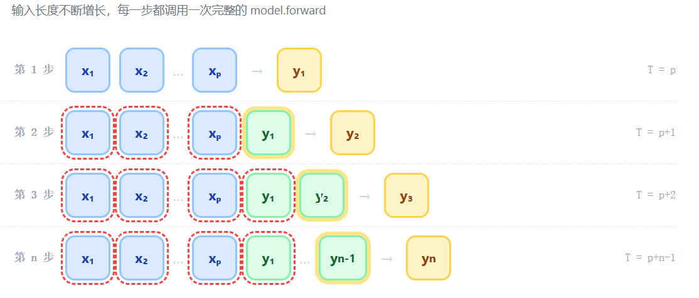
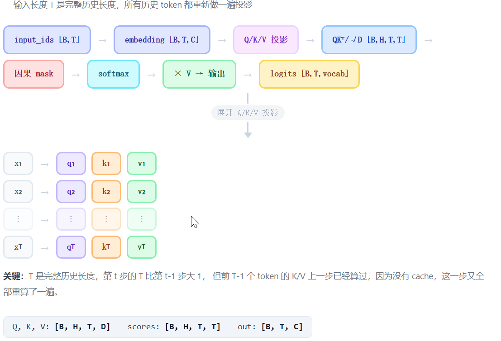
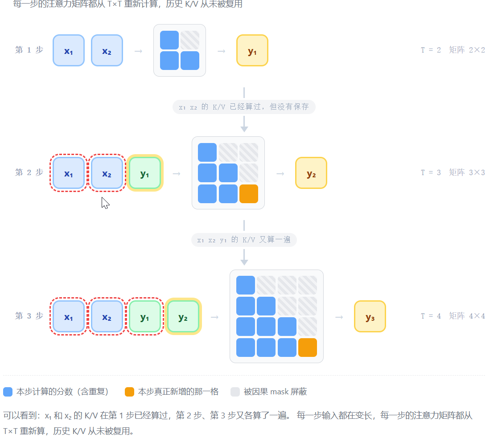
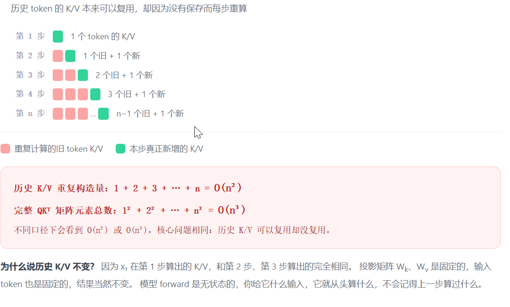

# 第 4 章 KV Cache 优化

## 1 没有 KV Cache 的计算

在自回归语言模型的生成过程中，模型每次只预测下一个 token，然后把新生成的 token 拼接到输入序列末尾，再预测下一个，如此反复。这个过程中，如果没有 KV Cache，模型会表现出一种“完全失忆”的行为：它不记得上一步计算过什么，每一次预测都必须把迄今为止的完整历史重新送进网络，从头算一遍。

这意味着，生成第 1 个 token 时，模型处理的是整个 prompt；生成第 2 个 token 时，模型处理的是 prompt 加上第 1 个生成结果；生成第 3 个 token 时，输入又长了一截。每一步的输入都在变长，而模型对其中每一个历史 token 都要重新做投影、重新算注意力。这种重复计算，正是无 KV Cache 时效率低下的根源。

### 1.1 

假设 prompt 是 x₁, x₂, …, xₚ，我们想生成 n 个新 token。无 KV Cache 的生成循环是这样的：
第一步，把整个 prompt 送入模型，得到第一个新 token y₁；
第二步，把 prompt 和 y₁ 拼在一起，再次送入模型，得到 y₂；
第三步，把 prompt、y₁、y₂ 拼在一起，又送入模型，得到 y₃……依此类推，直到生成第 n 个 token。

在代码层面，这个循环通常写成：每次调用 `model(input_ids)`，其中 `input_ids` 是当前完整的序列。模型返回所有位置的 logits，但我们只关心最后一个位置，因为只有它才代表“下一个 token”的预测。取出最后一个位置的 logits，采样或取 argmax，得到新 token，然后把它拼到序列末尾，进入下一轮。

输入是整个历史序列，而不是只输入新 token。模型会对所有 token 做前向计算，尽管我们只需要最后一个位置的输出。前面的历史 token 被一遍又一遍地重新计算，它们的 Key 和 Value 明明没有变化，却因为没有被保存下来，每次都要重新算一遍。

## 注意力内历史 K/V 被反复计算

为了看清浪费发生在哪里，我们来看单步内部的计算。假设第 t 步输入序列长度为 T，输入形状是 B×T（B 是 batch size）。经过 embedding 后，张量变成 B×T×C（C 是隐藏维度）。然后进入每一层 Transformer Block。

在注意力层里，模型首先对所有 T 个位置做线性投影，得到 Query、Key、Value。它们的形状都是 B×H×T×D，其中 H 是注意力头数，D 是每个头的维度。注意，这里的 T 是完整历史长度，所以所有历史 token 都重新做了 Q、K、V 投影。

接着计算注意力分数：Query 与 Key 的转置相乘，再除以 sqrt(D)，得到一个 B×H×T×T 的矩阵。这个矩阵的每个元素代表某个 query 位置与某个 key 位置之间的关联强度。然后加上因果 mask，确保第 i 个 query 只能看到位置 j ≤ i 的 key，也就是不能“偷看”未来的 token。mask 之后做 softmax，再与 Value 相乘，得到注意力输出。之后经过输出投影、残差连接、LayerNorm、MLP，继续下一层。

整个过程中，T 是完整历史长度。第 t 步的 T 比第 t-1 步大 1，但前 T-1 个 token 的 K/V 在第 t-1 步已经算过了。因为没有 cache，它们在第 t 步又被重新投影、重新参与注意力分数的计算。这就是重复劳动。

## 一个具体的例子

假设 prompt 只有两个 token：x₁ 和 x₂。我们想生成三个新 token。

第一步，输入是 [x₁, x₂]，长度为 2。模型计算所有位置的 Q、K、V，注意力分数矩阵是 2×2。取最后一个位置的 logits，采样得到 y₁。

第二步，输入变成 [x₁, x₂, y₁]，长度为 3。模型重新计算 x₁ 的 K/V、x₂ 的 K/V，以及新加入的 y₁ 的 K/V。注意力分数矩阵变成 3×3。取最后一个位置的 logits，得到 y₂。

第三步，输入变成 [x₁, x₂, y₁, y₂]，长度为 4。模型又从头计算 x₁、x₂、y₁、y₂ 的 K/V，注意力分数矩阵变成 4×4。取最后一个位置的 logits，得到 y₃。

可以看到，x₁ 和 x₂ 的 K/V 在第一步已经算过，但第二步、第三步又各算了一遍。y₁ 的 K/V 在第二步算过，第三步又算了一遍。每一步的输入都在变长，每一步的注意力矩阵都从 T×T 重新计算，历史 token 的 K/V 从未被复用。

## 重复量到底有多大

这种重复计算的量是可以量化的。如果只看历史 token 的 K/V 投影，第 1 步算了 1 个 token 的 K/V，第 2 步算了 2 个，第 3 步算了 3 个……第 n 步算了 n 个。总重复构造量是 1+2+3+…+n，也就是 O(n²)。这就是很多文章说“无 KV Cache 是 O(n²)”的来源之一。

如果看每一步完整的 QK^T 矩阵元素总数，第 t 步的矩阵是 t×t，累计起来是 1²+2²+…+n²，也就是 O(n³)。所以不同口径下会看到 O(n²) 或 O(n³) 的说法。通常标题里说的“从 O(n²) 到 O(n)”，是在强调 decode 单步不再重算完整历史，而是当前 query 只查历史 cache，单步注意力从 T×T 变成 1×T。

但无论哪种口径，核心问题都是一样的：历史 token 的 K/V 本来可以复用，却因为没有保存而每步重算。模型 forward 是无状态的，你给它什么输入，它就从头算什么，不会记得上一步算过什么。

## 有 KV Cache 时，区别在哪里

有了 KV Cache 之后，情况就完全不同了。Prefill 阶段仍然要完整处理 prompt，一次性算出所有 prompt token 的 K/V，但这次每层都会把 K/V 保存到 cache 里。到了 decode 阶段，每一步只输入新生成的 token，形状是 B×1。模型只计算当前 token 的 Q、K、V，然后把新的 K、V 追加到 cache 中。当前 token 的 Query 直接与全量历史 K/V 做注意力，分数矩阵是 1×T_cache，而不是 T×T。

这样，历史 token 的 K/V 不再重算，只读取 cache。单步 decode 从“重新处理完整序列”变成“只处理当前 token，查历史 cache”。计算量大幅下降，代价是显存中多了一份随序列长度增长的 K/V cache。

## 一句话总结

没有 KV Cache 时，生成第 t 个 token 的计算方式是：把 prompt 和已经生成的所有 token 拼成完整序列，送入模型，每一层重新计算所有历史 token 的 Q、K、V，重新算 T×T 因果注意力，只取最后一个位置的 logits，采样下一个 token，拼到序列末尾，下一步再来一遍。核心浪费在于：历史 token 的 K/V 本来可以复用，但无 cache 时每步都重新算了一遍。

---

## 第 2 章：核心思想：KV Cache 到底缓存了什么

**2.1 本章学习目标**  
目标两个：①能说清 cache 存什么、何时写、何时读；②能解释为什么 Q 不缓存，只缓存 K/V。

**2.2 本章主线**  
`prefill 一次算完 prompt → 每层保存 K/V → decode 只算当前 token 的 q,k,v → 新 k,v 追加到 cache → 当前 q 与全量 K/V 做 Attention → 得到下一个 token`。每站职责讲清楚。

**2.3 为什么要这样拆**  
四个理由，第一个讲透、后三个带过：  
① K/V 只与历史 token 绑定，不随当前 query 改变，所以可复用；Q 只属于当前 token，缓存无意义。  
② 用显存换计算：cache 占显存，但省掉重复投影和重复 Attention 分数计算。  
③ Prefill 与 decode 共用 Attention，只是输入长度不同。  
④ 为批处理、分页、量化留接口。

**2.4 代码走读：跟着 cache 走一遍**  
看 `model.py` 中 `CausalSelfAttention` 的 `past_kv` / `use_cache` 分支；看 `generate.py` 中 `prefill` 初始化 cache、`decode` 追加 cache。每站当黑盒，只看进 `B,1,C`、出 `B,1,C`。

**2.5 形状与常见坑**  
Cache 形状 `[B,H,T,D]` 或 `[B,H,D,T]`；拼接轴；位置偏移；首次 prefill 无 cache。

**2.6 总结与测试题**  
画图：画出 cache 的“写一次、读多次”读写图，就算完成。

---

## 第 3 章：复杂度推导：从 O(n²) 到 O(n)

**3.1 本章学习目标**  
目标两个：①能推导生成 n 个 token 的总计算量；②能区分 prefill 的 O(n²) 和 decode 的 O(n)。

**3.2 本章主线**  
无 cache：总 Attention 计算约 `1+2+…+n = O(n²)`。  
有 cache：每步只算当前 q 与历史 K/V，总计算约 `O(n)`。  
但 prefill 本身仍要处理完整 prompt，所以 prefill 还是 O(n²)。每站职责讲清楚。

**3.3 为什么要这样拆**  
四个理由，第一个讲透、后三个带过：  
① O(n²) 指总注意力分数计算，O(n) 指 decode 阶段每步增量。  
② Prefill 是 compute-bound，decode 是 memory-bound。  
③ Cache 降计算，但升显存，显存随序列长度 O(n)。  
④ 长上下文下，O(n) 也不便宜，需要分页、量化、GQA 等优化。

**3.4 代码走读：跟着复杂度变化走一遍**  
看 `generate.py` 中 prefill 一次、decode n 次；打印每步 `T_cache`、logits 形状、耗时。看 `attention.py` 中 Q 长度从 T 变 1。

**3.5 形状与常见坑**  
`QK^T` 从 `T×T` 变 `1×T`；softmax 轴；cache 长度递增；位置编码偏移；显存估算。

**3.6 总结与测试题**  
画图：画出 prefill vs decode 的复杂度对比表，就算完成。

---

## 第 4 章：代码实现：给 Attention 加 KV Cache

**4.1 本章学习目标**  
目标两个：①能写出支持 cache 的 Attention forward；②能跑通 prefill + decode 生成。

**4.2 本章主线**  
`forward(x, past_kv=None, use_cache=True) → 算 q,k,v → 若 past_kv 存在则 concat → 更新 cache → 用全量 K/V 算 Attention → 输出`。每站职责讲清楚。

**4.3 为什么要这样拆**  
四个理由，第一个讲透、后三个带过：  
① Cache 作为可选输入，保持训练与推理兼容。  
② Prefill 与 decode 共用 Attention，减少分支。  
③ 每层独立 cache，方便按层管理显存。  
④ 为批处理、PagedAttention、PD 分离留口。

**4.4 代码走读：跟着代码走一遍**  
看 `model.py` 的 `CausalSelfAttention`、`Block`、`Transformer`；看 `generate.py` 的 `prefill`、`decode`、`sample`。每站当黑盒，只看进什么、出什么。

**4.5 形状与常见坑**  
Cache 初始化 `None`；拼接维度；位置 id；mask 只对当前 query；首次 prefill 与后续 decode 分支。

**4.6 总结与测试题**  
画图：给无 cache 版加上 cache，跑通 greedy 生成，就算完成。

---

## 第 5 章：边界与进阶：显存、分页、量化与生产优化

**5.1 本章学习目标**  
目标两个：①能说出 KV Cache 的显存代价；②能列举至少三种生产优化方向。

**5.2 本章主线**  
`cache 显存公式 → MQA/GQA → PagedAttention → KV 量化 → 滑窗/淘汰 → PD 分离`。每站职责讲清楚。

**5.3 为什么要这样拆**  
四个理由，第一个讲透、后三个带过：  
① O(n) 计算不等于免费，显存墙是长上下文的核心瓶颈。  
② MQA/GQA 减少 K/V 头数，直接降 cache 显存。  
③ PagedAttention 解决碎片与动态分配。  
④ 量化、淘汰、PD 分离面向生产引擎。

**5.4 代码走读：跟着优化接口走一遍**  
看 cache 分配、block table、分页逻辑；若无，留伪代码。每站当黑盒，只看进什么、出什么。

**5.5 形状与常见坑**  
显存估算；batch 增大；cache 碎片；正确性校验；量化误差。

**5.6 总结与测试题**  
画图：画出完整链路，并标注 O(n²) → O(n) 发生在哪一步，就算完成。
