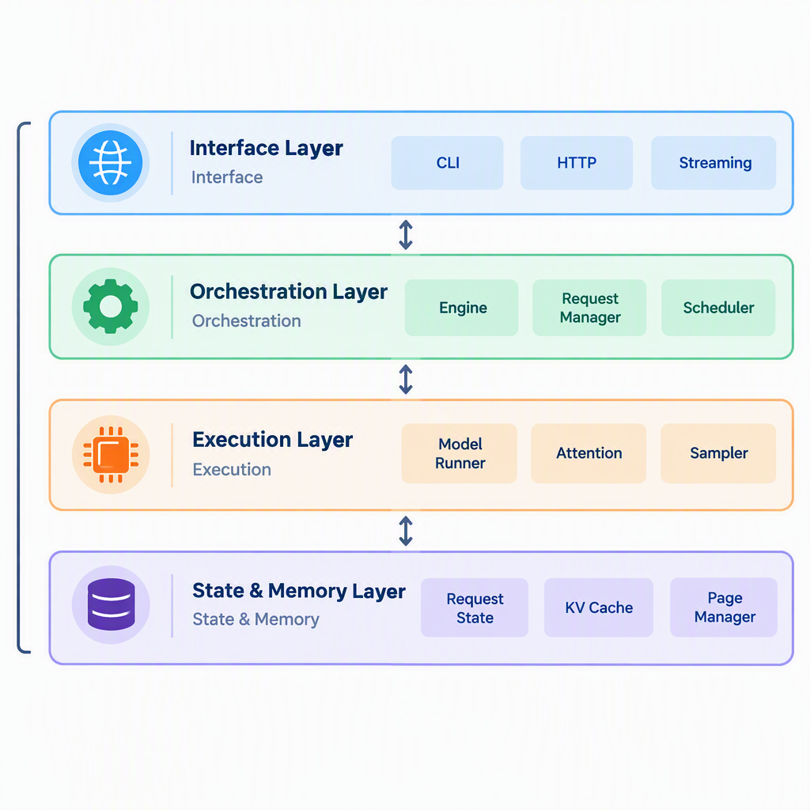
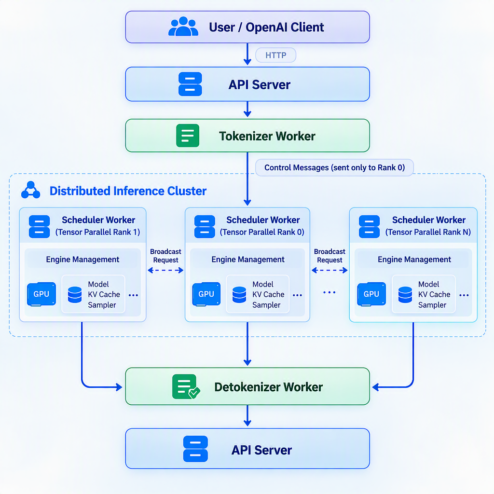
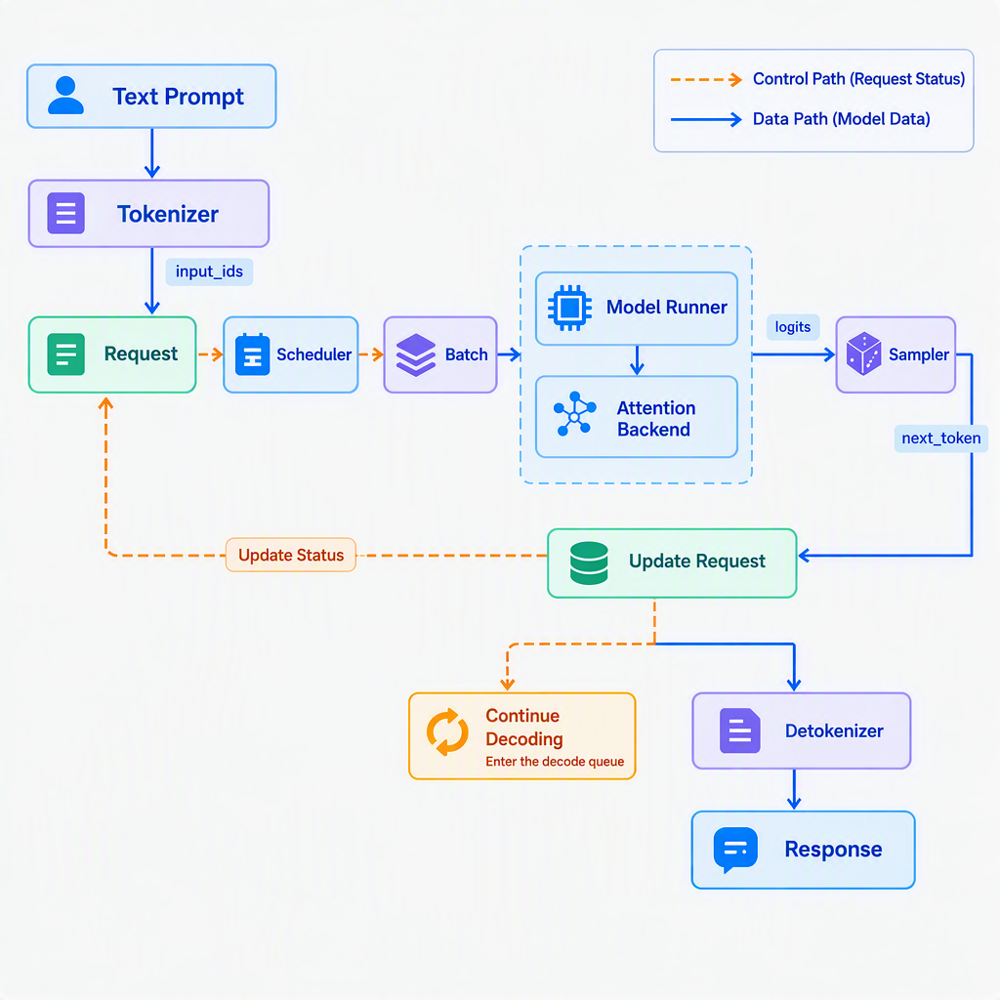
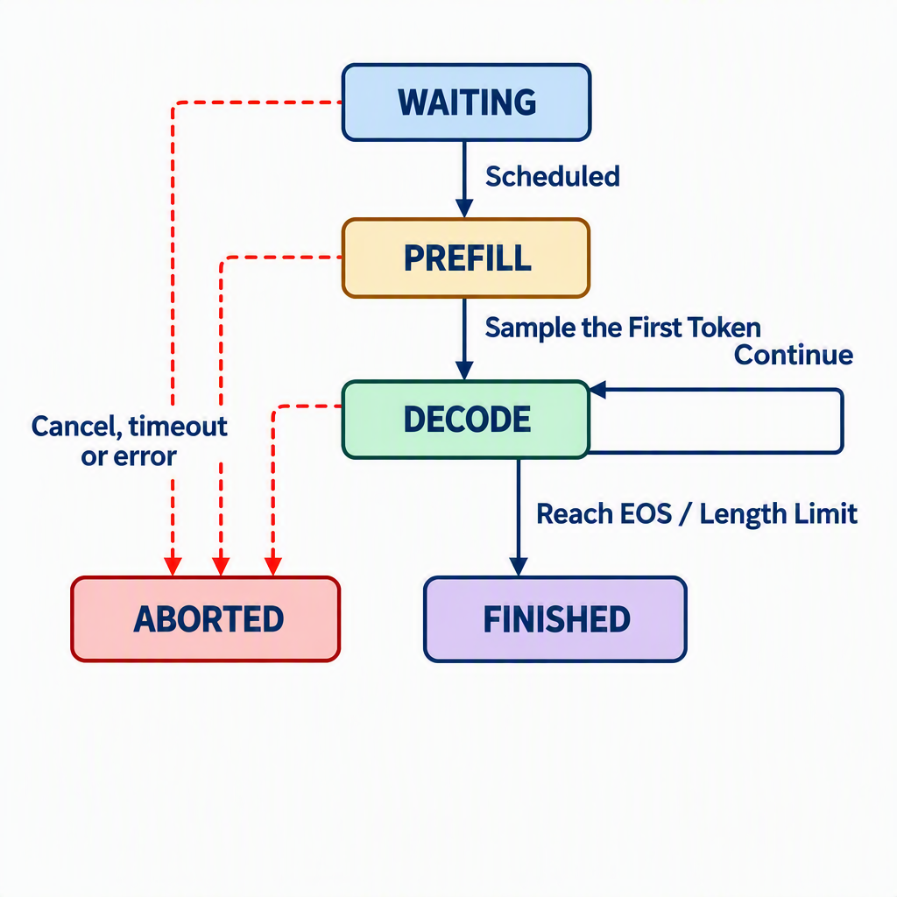

# Chapter 1 mini-sglang: What an Inference Engine Looks Like

In Part I, we examined LLM inference from the perspectives of models and hardware. We learned that a model generates tokens autoregressively, one at a time; Prefill processes the input context; Decode produces subsequent tokens; and the KV Cache avoids recomputing information from previous tokens. We also introduced metrics such as TTFT, TPOT, and throughput, showing that an inference system must do more than merely generate text: it must balance latency, throughput, and memory usage.

These concepts, however, have not yet shown us how a complete inference system works. When a user request enters the system, which component receives it? Who decides which requests to process in the current iteration? Where is the KV Cache produced by model computation stored? How are generated tokens turned into a streaming response? These are the problems that an inference engine must solve.

This chapter does not begin with a specific optimization. Instead, it first lays out the overall structure of mini-sglang. Starting from the simplest form of model invocation, we will examine the relationships among requests, batches, the scheduler, the model executor, caches, and serving interfaces. The following chapters will build on this structure by adding capabilities one at a time, gradually turning a text-generation program into a genuine inference engine.

## 1 Learning Objectives

After completing this chapter, you will be able to:

- Explain the difference between model invocation and an inference engine.
- Draw the main components and data flow of a minimal inference engine.
- Describe the basic states that a request passes through from arrival to response.
- Explain what core objects such as `Req`, `Batch`, and `Context` store.
- Explain why Part II implements mini-sglang in the order of correctness, efficiency, serving, scheduling, memory management, and scaling.

This chapter does not cover the mathematical derivation of Attention, how the KV Cache is organized and managed in GPU memory, the scheduling algorithm of Continuous Batching, or the low-level implementation of multi-GPU communication. These topics will be implemented and evaluated in later chapters.

## 2 From Model Invocation to an Inference Engine

### 2.1 Starting with an Autoregressive Generation Loop

Consider the simplest conceptual autoregressive generation loop. Assume that the model has already been loaded and that `model` returns logits for the input tokens:

```python
input_ids = tokenizer.encode(prompt)

for _ in range(max_new_tokens):
    logits = model(input_ids)
    next_token = sample(logits[:, -1, :])
    input_ids = append(input_ids, next_token)

output = tokenizer.decode(input_ids)
```

This code contains the basic steps required to generate text: encode the input, run a forward pass, sample the next token, append that token to the sequence, and repeat. It shows how a model generates the next token from the existing sequence, but it does not handle the request management, computation scheduling, and resource management required by an inference service.

Even when processing only one request, this program performs substantial redundant computation: every iteration sends the complete `input_ids` sequence through the model again. As the sequence grows, intermediate results for previous tokens are recomputed repeatedly. The KV Cache introduced in Part I reuses these results and reduces computation during Decode.

When the program must serve multiple users at the same time, the problem expands from "how to generate one token" to "how to continuously organize a set of requests." The system must determine which component records request state, which component schedules each iteration, which component runs the model, and which component manages the resulting cache. More specifically, it must answer the following questions:

- How should multiple requests arriving at the same time be queued?
- Which requests should be processed together in the current iteration?
- How many tokens has each request generated, and has it met a stopping condition?
- Where should the Keys and Values for previous tokens be stored?
- How should cache space be released when a request finishes?
- How should generated tokens be converted back into text and returned to the client?

An inference engine is therefore more than an HTTP wrapper around a model. More precisely, **the model performs neural network computation, while the inference engine organizes that computation.** The engine manages request lifecycles, determines the order of computation, preserves intermediate state, and exposes the underlying computation through a stable serving interface.

### 2.2 Four Core Responsibilities of an Inference Engine

The responsibilities of an inference engine can be grouped into four categories.

The first is **input and output management**. The engine receives text, sampling parameters, and length limits, and converts the text into token IDs. After generation, it converts token IDs back into text and, when needed, streams the generated output incrementally. The Tokenizer and Detokenizer, which encode input text and decode generated output respectively, belong to this category.

The second is **request orchestration**. Each request has its own input length, generated length, stopping conditions, and cache state. The engine must record this information and clean up when a request finishes, is cancelled, or encounters an error.

The third is **computation scheduling**. GPUs are well suited to batched matrix operations, but requests may have different input and output lengths. The scheduler must decide which requests to place in each batch and whether the current iteration performs Prefill or Decode.

The fourth is **state and memory management**. Decode continuously produces new KV Cache entries. The engine must not only preserve this data, but also allocate, reuse, and release cache space. These responsibilities lay the foundation for paged caching and prefix reuse in later chapters.

> In summary, the inference engine decides which requests to compute, when to compute them, which tokens to process, and how to preserve the results.

## 3 Overall Architecture of mini-sglang

### 3.1 From Responsibility Layers to the Process Structure

The previous section identified the responsibilities of an inference engine. To see how they form a complete system, we first divide mini-sglang into four logical layers:

<div align="center">
  
  <p><em>Figure 1.1 The logical layers of mini-sglang</em></p>
</div>

These layers organize the modules of the inference engine by responsibility, allowing us to see which problem each part solves. They are logical layers and do not map one-to-one to runtime processes.

- **Interface layer**: handles how requests enter the system and how results leave it.
- **Orchestration layer**: tracks available requests and decides what to execute in the current iteration.
- **Execution layer**: performs model forward passes and sampling.
- **State and memory layer**: stores request history and cache data.

In the educational implementation developed later, a small number of Python modules will initially carry these responsibilities so that the complete data flow remains easy to observe. The official implementation distributes the responsibilities across multiple worker processes that cooperate through inter-process messaging and distributed communication. The responsibilities are similar, but the runtime organization differs.

The logical layers describe how responsibilities relate to one another, but they do not directly show how the running system is organized. If we shift from "what each module does" to "which processes perform the work," the official mini-sglang architecture looks more like this:

<div align="center">
  
  <p><em>Figure 1.2 The process structure of mini-sglang</em></p>
</div>

In this diagram, the API Server is the user-facing entry point. The Tokenizer Worker and Detokenizer Worker convert between text and tokens. The Scheduler Worker manages requests and determines when computation runs, while the Engine manages the model, cache, and actual computation. The key point here is that separate processes can take responsibility for different tasks and cooperate with one another. You do not need to memorize how these processes are launched or how they communicate yet.

The layered view and process view answer two different questions: what responsibilities the system contains, and how those responsibilities run. We can now follow a request through the system to see how the components cooperate.

### 3.2 How a Request Flows Through the Architecture

When a request enters the system, it changes request state and also moves model data among components. To distinguish these two kinds of information, we can divide the request flow into a control path and a data path:

<div align="center">
  
  <p><em>Figure 1.3 The control path and data path in mini-sglang</em></p>
</div>

- The **control path** carries request state: whether a request is waiting, running Prefill, ready for Decode, or finished. It is handled mainly by the Engine and Scheduler.

- The **data path** carries the inputs and outputs of model computation, including `input_ids`, positions, logits, and the KV Cache. It passes mainly through the Batch, Model Runner, and Attention backend.

The control path determines which requests to compute in the current iteration, while the data path determines what data the model uses for that computation. Keeping these paths distinct helps us reason separately about scheduling decisions and model execution. Later chapters will use both perspectives to examine how each new mechanism changes the system.

In the official implementation, both paths cross multiple processes. This chapter establishes only the overall picture. The next chapter follows the actual code to trace a request from the API Server through the Scheduler, Engine, and Detokenizer.

The control path also records the current processing stage of each request. The following simplified state machine shows the main states from arrival to completion:

<div align="center">
  
  <p><em>Figure 1.4 A simplified request state machine</em></p>
</div>

The states have the following meanings:

- `WAITING`: the request has been accepted but has not entered model computation.
- `PREFILL`: the engine processes the input prompt, creates the initial KV Cache, and computes the logits needed to generate the first output token.
- `DECODE`: each iteration processes the newly generated token and appends to the KV Cache.
- `FINISHED`: the request has produced an end-of-sequence token or reached its maximum generation length.
- `ABORTED`: the request has been cancelled, timed out, or encountered an error.

This state machine is an educational abstraction for understanding the flow; it does not imply that the source code defines states with exactly these names. A real system may distinguish additional conditions such as queuing, pausing, and preemption. These primary states are sufficient for explaining generation, scheduling, and cache reclamation in later chapters.

The state machine shows the stages of a request but not the work performed by each component. Consider a user request with the following input:

```text
Prompt: Please explain what the KV Cache is.
max_new_tokens: 8
```

The request moves through the engine as follows:

1. The Server receives the text and generation parameters.
2. The Tokenizer encodes the text into `input_ids`.
3. The system creates a request object and places it in the waiting queue.
4. The Scheduler selects the request and constructs a Prefill batch.
5. The Model Runner performs a forward pass and writes the initial KV Cache.
6. The Sampler selects the first token from the logits.
7. The request enters Decode, generating one additional token in each iteration.
8. After the request reaches its length limit, the Detokenizer converts the token IDs into text and returns the result.

These eight steps connect the processes, control path, and data path introduced above. Later chapters will return to this example repeatedly: Chapter 3 implements a minimal version of Steps 5 through 7; Chapter 4 eliminates redundant computation during Decode; Chapter 5 adds HTTP serving and streaming; Chapter 6 lets multiple requests share the scheduling loop; and Chapters 7 and 8 improve cache allocation and prefix reuse.

### 3.3 From Architecture Modules to Source Code

The previous two sections described mini-sglang as a running system. To apply this understanding while reading and writing code, we must also know where each responsibility appears in the source tree. The official mini-sglang source code lives under `python/minisgl/`. This chapter uses commit `9a91cfafe754aa85daee49998176275667eb58f2` from the `main` branch on September 16, 2026, as its reference baseline. In that revision, the package is organized into the following subpackages:

```text
python/minisgl/
├── attention/       # Attention backends and metadata
├── benchmark/       # Benchmarking utilities
├── distributed/     # Distributed execution
├── engine/          # Model, cache, execution, and sampling on one TP worker
├── kernel/          # Low-level compute kernels
├── kvcache/         # KV Cache pools, handles, and cache implementations
├── layers/          # Transformer layers
├── llm/             # User-facing Python LLM interface
├── message/         # Serializable messages exchanged between workers
├── models/          # Model architectures
├── moe/             # MoE backends
├── scheduler/       # Scheduler, request queues, and batch management
├── server/          # API Server, command-line arguments, and launch logic
├── tokenizer/       # Tokenization and detokenization
├── utils/           # Shared utilities
├── core.py          # Data structures shared across modules
└── __main__.py      # Entry point for python -m minisgl
```

You do not need to read the entire source tree at this point. Its purpose here is to provide an index from questions to code: look in `core.py` for request and batch state, `scheduler/` for scheduling, `kvcache/` for caching, and `server/` for the serving entry point.

You can also work backwards from a feature to its implementation. Model architectures and weight loading live in `models/`; tensor-parallel layers and communication live in `layers/` and `distributed/`; Attention implementations live in `attention/`; and low-level CUDA kernels live in `kernel/`. Locating modules by the problem they solve is more effective for a first reading than traversing files from the top of the directory tree.

Besides organizing functionality into directories, mini-sglang connects modules through shared data structures. `core.py` defines the most important of these objects: `SamplingParams`, `Req`, `Batch`, and `Context`. Understanding what they store and how they relate to one another reveals the relationships among request state, batched computation, and the runtime environment.

`SamplingParams` stores sampling configuration such as temperature, `top_k`, `top_p`, whether to ignore EOS, and the maximum generation length. Keeping these values in a dedicated object avoids passing a long list of optional parameters through the Engine, Sampler, and Server interfaces.

`Req` represents one request. In the reference implementation, it needs to track:

- Input token IDs.
- The current and maximum sequence lengths.
- The number of tokens already cached.
- A unique request identifier.
- Sampling parameters.
- The associated cache handle.

The current sequence length and cached length are different concepts. The former indicates how many tokens the request currently contains; the latter indicates how many of those tokens already have Key and Value states available for reuse by the current execution path. The `extend_len` property in the official implementation is the difference between the two. This distinction becomes important in the KV Cache chapter.

`Batch` represents the requests included in one model execution. In addition to the request list, the scheduler prepares the current `input_ids`, positions, output locations, and padding information, while the Attention backend supplies the metadata needed for computation. The official implementation uses `phase` to distinguish `prefill` from `decode`, because the two phases organize their inputs and access Attention states differently. In other words, `Batch` carries the Scheduler's decision and arranges it into input that the model can execute.

`Context` stores runtime dependencies shared during a forward pass, such as the Attention backend and KV Cache pool. It belongs to the current execution rather than to an individual request. Later chapters will cover its internal data layout and cache-management details.

The relationship among these four objects can be summarized as follows:

```text
Context
  ├── KV Cache Pool
  ├── Attention Backend
  └── Current Batch
          └── Multiple Req objects
                  └── SamplingParams + Cache Handle
```

At this point, we have built an overall picture of mini-sglang from four perspectives: responsibilities, processes, request flow, and the source tree. The next section uses this architectural map to explain how Part II progressively adds the capabilities required by an inference engine.

## 4 Implementation Roadmap for Part II

### 4.1 Why We Use an Incremental Implementation

A complete inference engine involves the model architecture, batching, asynchronous serving, GPU memory, cache policies, and multi-GPU communication. If we introduce all these capabilities at once, the code may grow quickly, but it becomes difficult to identify which problem each mechanism solves.

Part II therefore follows an incremental implementation. Each chapter first examines a limitation of the current version, adds one targeted module, and then verifies the change with a correctness test or benchmark. By introducing one main concept at a time, we can see why the system needs it and how it changes the data flow.

Following this approach, Part II progressively adds request flow, model generation, caching, serving, scheduling, and multi-GPU scaling, as summarized below.

| Chapter | Main limitation of the current version | New capability | Primary validation |
|---|---|---|---|
| Chapter 2 | The overall architecture is clear, but the flow of a request through the actual source code is not | Trace the complete path from request arrival to response | Draw the request path and locate the key files |
| Chapter 3 | There is no working autoregressive generation implementation yet | Forward pass, generation loop, and sampling | Output correctness |
| Chapter 4 | Decode recomputes previous tokens | KV Cache | Computation, TPOT |
| Chapter 5 | The engine is accessible only through Python function calls | HTTP, concurrent requests, and streaming | End-to-end latency |
| Chapter 6 | Requests can be processed only one at a time or in static batches | Continuous Batching and the Scheduler | Throughput, TTFT |
| Chapter 7 | Cache allocation wastes space and causes fragmentation | Paged KV Cache and memory management | Memory utilization, concurrency |
| Chapter 8 | Shared prefixes are recomputed across requests | RadixAttention and Prefix Caching | Cache hit rate, TTFT |
| Chapter 9 | A single GPU limits model capacity and throughput | Multi-process execution and Tensor Parallelism | Multi-GPU scaling |
| Chapter 10 | Every output token still requires a full-model pass | Speculative Decoding | Acceptance rate, generation speed |

### 4.2 Moving from One Problem to the Next

The table lists the capabilities introduced in each chapter. They are not independent features; each one follows from a limitation exposed by the previous version. Connecting these limitations gives the following implementation path:

```text
Understand how requests flow
        ↓
Make generation correct
        ↓
Historical computation is repeated → KV Cache
        ↓
The program cannot serve users → HTTP / Streaming
        ↓
Requests block one another → Continuous Batching / Scheduler
        ↓
Cache allocation wastes memory and causes fragmentation → Paged KV Cache
        ↓
Shared prefixes are recomputed → Prefix Caching
        ↓
A single GPU limits capacity and compute → Tensor Parallelism
        ↓
Decode still advances one token at a time → Speculative Decoding
```

Each mechanism introduced in the following chapters should answer four questions:

1. What is the bottleneck in the current implementation?
2. Which part of the data path or control path does the new mechanism change?
3. Which objects and interfaces must be added to the code?
4. Which experimental metrics demonstrate that the mechanism is effective?

Following this chain of problems, readers need to understand only one new mechanism at a time and observe how it changes the existing system. The result is not only a working mini-sglang, but also a method for analyzing inference-engine problems.

## 5 Summary and Exercises

### 5.1 Summary

This chapter presented the overall structure of mini-sglang. The model performs forward computation, while the inference engine manages requests, scheduling, caching, sampling, and serving. A request typically follows the lifecycle `WAITING → PREFILL → DECODE → FINISHED`, and Part II progressively adds the efficiency and engineering capabilities needed to support that lifecycle.

The three key takeaways are:

1. Being able to invoke a model is only the starting point of an inference engine, not the end.
2. `Req`, `Batch`, and `Context` connect request state, one model execution, and the shared runtime environment.
3. The implementation order in Part II is driven by problems: first understand the request path and make generation correct, then address redundant computation, concurrent serving, cache management, and scaling.

### 5.2 Exercises

1. Why is a program that can execute `model(input_ids)` not yet a complete inference engine?

2. What responsibilities belong to the model itself, and what responsibilities belong to the inference engine? List at least three for each.

3. What do `Req`, `Batch`, and `Context` represent, and how are they related?

4. Which states can a request pass through between arrival and response? Under what conditions does it enter `FINISHED` or `ABORTED`?

5. Why is it useful to distinguish the control path from the data path? Give an example of the information carried by each.

6. Why does Part II implement single-request generation before adding the KV Cache, HTTP serving, and Continuous Batching? What learning and debugging difficulties would arise if this order were changed?

7. What responsibilities do the official mini-sglang directories `engine`, `scheduler`, `kvcache`, `server`, and `tokenizer` have?

## References

- [Official mini-sglang Repository (reference commit 9a91cfa)](https://github.com/sgl-project/mini-sglang/tree/9a91cfafe754aa85daee49998176275667eb58f2)
- [mini-sglang: `python/minisgl` Source Tree](https://github.com/sgl-project/mini-sglang/tree/9a91cfafe754aa85daee49998176275667eb58f2/python/minisgl)
- [mini-sglang: Structure of Mini-SGLang](https://github.com/sgl-project/mini-sglang/blob/9a91cfafe754aa85daee49998176275667eb58f2/docs/structures.md)
- [mini-sglang: `core.py`](https://github.com/sgl-project/mini-sglang/blob/9a91cfafe754aa85daee49998176275667eb58f2/python/minisgl/core.py)
- [Official SGLang Repository](https://github.com/sgl-project/sglang)
