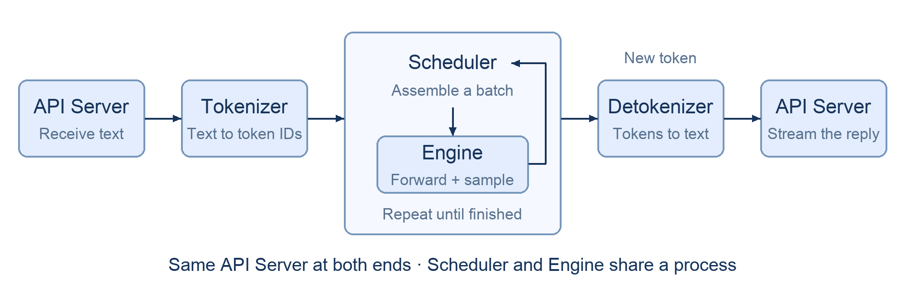

# Chapter 2 Inside SGLang: The Path of a Request

The previous chapter introduced the modules that make up an inference engine. This chapter follows one request to see how they fit together. The main pieces to distinguish are **the tokenizer, the scheduler, the engine (including the attention backend, forward pass, and memory allocation), and the serving frontend.** For now, knowing roughly what each module does is enough.

We will first cover the request path and how the work is divided across processes. Commands, message types, and a source walkthrough are in the companion [coding document](./Chapter2_Inside-SGLang_code.md). In the next chapter, we will implement the forward pass and generation loop ourselves.

## 1 Learning Objectives

After completing this chapter, you will be able to:

1. Draw the full path of a request from arrival to response, explaining each component's inputs, outputs, and responsibilities.
2. Distinguish the scheduler from the execution engine and explain where prefill and decode fit into a request's lifecycle.
3. Explain why streaming text requires decoding state and why resources must be reclaimed when a request finishes or is canceled.
4. Explain how multiple processes help with concurrency, scaling, and debugging, along with the communication costs they introduce.

## 2 Following a Request

Suppose a user asks, "What is KV Cache?" and wants to see the answer as it is generated. We can follow the request through five stages: receiving it, tokenizing the input, scheduling and computing, detokenizing the output, and returning the result. The final stage is handled by the same API Server that received the request; these five stages do not correspond to five separate processes.

### 2.1 The frontend receives the request

The API Server is the service's frontend. It receives HTTP requests, reads the input and sampling parameters, and assigns each request a unique internal identifier. Later messages carry this identifier so the frontend can send each request's results back to the right connection.

After handing the request to the next component, the frontend must continue accepting other requests. While it waits for generation, it keeps track of the current request's response state.

### 2.2 The tokenizer converts text into tokens

The model accepts token IDs, not strings. The tokenizer converts text into a sequence of integers. For a multi-turn conversation, a chat template first puts the roles and messages into the format the model expects.

This stage changes how the input is represented: text becomes token IDs, while the request identifier and sampling parameters continue along with it.

### 2.3 The scheduler selects work, and the engine executes it

New requests enter a waiting queue. The scheduler decides which requests to run next, how to group them into a batch, and whether their KV Cache will fit in GPU memory.

The model first processes the prompt, a stage called prefill. It then enters decode, using the existing context to generate subsequent tokens. This chapter covers ordinary autoregressive generation, where each step typically produces one new token for a request. Speculative decoding comes later.

The engine performs the actual model forward pass and sampling. The scheduler decides which requests to compute; the engine carries out that computation. In mini-sglang, they run in the same process, and the scheduler calls the engine directly. A module boundary does not necessarily mean a process boundary.

The forward pass produces logits: scores for candidate tokens in the vocabulary, not yet probabilities. The sampler selects the next token from these scores. Greedy decoding directly picks the highest-scoring candidate; random sampling with temperature first adjusts the logits, applies softmax to turn them into probabilities, and draws from that distribution. The selected token is appended to the request's sequence and becomes part of the context for the next step.

### 2.4 The detokenizer converts tokens back into text

The detokenizer converts newly generated token IDs into text. Decoding each token separately and concatenating the results does not always work: some tokens contain only part of a character's bytes, so decoding them on their own can produce replacement characters or incomplete text.

Detokenization therefore needs to preserve decoding state for each request. It uses the tokens already received to determine which text is complete and sends only the new, printable portion to the frontend.

### 2.5 The frontend streams the response

Strictly speaking, streaming is about improving time to the first visible output and the user experience, rather than speeding up model computation. With streaming enabled, each piece of new text returns to the API Server with its request identifier. The frontend finds the corresponding HTTP connection and sends the text in SSE (Server-Sent Events) chunks, so the user does not have to wait for the whole answer. To the user, the model appears to write the answer bit by bit. Without streaming, the user receives the answer only after decoding finishes. These days, almost every user-facing client streams its output—were non-streaming clients mostly a thing back in the early GPT days of 2022?

When the request reaches its generation limit or another stopping condition, generation stops and the frontend completes the response. If the user disconnects early, the engine must also cancel the request and reclaim its resources, rather than keep computing output that nobody will receive.

### 2.6 Putting the path together

The figure puts the request-handling modules together. Both ends represent the same API Server. The scheduler and engine share a box because they run in one process and communicate through function calls. Each new token from the generation loop goes to the detokenizer, and the frontend returns the new text.

There are three main transformations: the input text becomes token IDs, the model generates new tokens from the context, and the detokenizer turns those output tokens back into text. The request identifier stays with the request throughout, allowing every stage to associate its work with the same request.

Before moving on, check whether you can explain the data each stage handles, the difference between the scheduler and engine, and where the generation loop begins and ends.

## 3 Why Use Multiple Processes?

The previous section followed a single request, but a real service handles many at once: some have just arrived, some are being tokenized, and others are already generating. HTTP traffic mainly involves network I/O, tokenization and detokenization mainly use the CPU, and the forward pass mainly uses the GPU. Running all of this serially creates a bottleneck: when one stage slows down, other stages may have to wait too.

The purpose of splitting the work into processes is to let different requests and stages make progress at the same time. mini-sglang gives these processes their own state and has them communicate to hand off work. This allows work to overlap and reduces unnecessary waiting, at the cost of communication overhead.

### 3.1 Let different components work at the same time

Suppose request A is generating an answer when request B arrives with a long prompt. If the scheduling loop must finish tokenizing B before launching A's next computation, A's output may pause, and the GPU may wait for the CPU to submit more work. With separate processes, the tokenizer handles B's input while the scheduler keeps A moving. B still has to wait for its own tokenization to finish before it can join the computation.

SGLang's usual single-tokenizer serving mode is a practical example: the HTTP Server and TokenizerManager share a process, while the scheduler and detokenizer run in separate subprocesses. Input processing and output decoding are thus separated from GPU scheduling. See the [SGLang startup implementation](https://github.com/sgl-project/sglang/blob/main/python/sglang/srt/entrypoints/engine.py) for the process layout.

A single process can also use threads, asynchronous I/O, and asynchronous GPU execution to do work concurrently. Multiple processes make those execution flows easier to manage separately; they do not remove dependencies within an individual request.

### 3.2 Coordinate multiple GPUs

When a model does not fit on one GPU, or when we want several GPUs to share the computation, multiple execution units must work together. With four-way tensor parallelism, for example, each GPU holds part of the model weights, performs its share of the computation, and exchanges results through collective communication to complete a forward pass together.

mini-sglang starts one scheduler worker per GPU. SGLang's tensor-parallel setup likewise creates a process for each rank, with each worker managing execution on its GPU. These four workers serve the same batch of requests, however, so their scheduling and communication must agree. They cannot independently choose different requests. Chapter 9 covers the implementation.

### 3.3 Adjust the number of workers where requests are backing up

Once components are separated, we can add resources where work is actually queuing. Suppose many requests have long inputs: text is waiting to be tokenized, while the GPU does not have enough ready requests to compute. Adding more GPUs may not help. More tokenizer workers can let several CPU processes share the input processing and supply work to the scheduler sooner.

mini-sglang supports a configurable tokenizer count. SGLang also has a multi-tokenizer mode, with a routing component handling message handoffs, so each tokenizer does not need its own copy of the model on a GPU. But if the GPU is already the bottleneck, adding tokenizers will only move more requests into the next queue. Before scaling a component, first check where the time is going.

### 3.4 Make communication and debugging boundaries clear

After a split, handing off work becomes an exchange of messages across processes rather than an ordinary function call. mini-sglang mainly uses ZeroMQ for control messages and collective communication for GPU data exchange in tensor parallelism. Following the request identifier through the component logs helps narrow down where a problem occurred: tokenization, scheduling, the frontend server, or another stage.

These boundaries help locate problems, but do not provide automatic recovery. If a process exits, it may lose its request state while other processes are still waiting for its messages. Shutdown, cleanup, or restart must therefore be coordinated. Message transfer, initialization, and state synchronization also have costs. Separate address spaces do not mean that processes can never use shared memory.

Multiple processes trade communication and management overhead for overlapping execution and clearer ownership of resources. Moving prefill and decode onto different machines later also requires KV Cache transfer and scheduling across nodes; separating processes alone does not solve those problems.

Before moving on, check whether you can name two tasks that can overlap, explain why workers on different GPUs must coordinate, and identify at least one cost of using multiple processes.

## 4 Summary and Exercises

### 4.1 Summary

1. The request path. A request passes through the API Server, tokenizer, scheduler and engine, and detokenizer before the API Server returns the result. The request identifier connects state across the stages. The tokenizer and detokenizer convert between text and tokens; the scheduler manages execution order and resources; the engine runs the forward pass and sampling.

2. The benefits of multiple processes. Separating components lets their work overlap and provides clearer boundaries for scaling and debugging. **System design always involves tradeoffs; there is no perfect design.** Multiple processes also bring communication and synchronization costs. Next, read the [coding document](./Chapter2_Inside-SGLang_code.md) to find these responsibilities in the source.

### 4.2 Exercises

1. Close this chapter and draw the full request path from arrival to response. Label each component's inputs and outputs, along with the three main transformations of the data.
2. Mark the generation loop. Explain what the scheduler and engine each do, and whether they must run in separate processes.
3. Why does the detokenizer need state for each request? What can go wrong if each token is decoded independently?
4. If the user disconnects midway, what must the frontend and scheduler each handle?
5. What is gained by running the tokenizer and scheduler in separate processes? Why must communication costs still be considered?

## References

- [mini-sglang architecture: components, request flow, and process responsibilities](https://github.com/sgl-project/mini-sglang/blob/main/docs/structures.md)
- [mini-sglang startup: process creation and initialization](https://github.com/sgl-project/mini-sglang/blob/main/python/minisgl/server/launch.py)
- [mini-sglang scheduler: request scheduling and the generation loop](https://github.com/sgl-project/mini-sglang/blob/main/python/minisgl/scheduler/scheduler.py)
- [SGLang startup: serving processes, tensor parallelism, and multi-tokenizer mode](https://github.com/sgl-project/sglang/blob/main/python/sglang/srt/entrypoints/engine.py)
