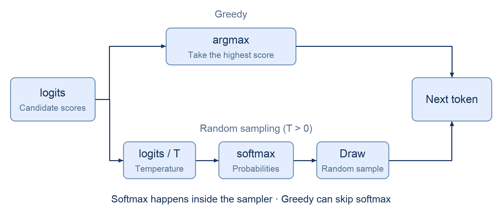

# Chapter 2 Inside SGLang: The Path of a Request (Code Walkthrough)

The concept document introduced mini-sglang's main modules. Here, we will send a request and open the source to see which functions handle it after it reaches the HTTP endpoint, and how the answer eventually gets back to the terminal.

Read the [concept document](./Chapter2_Inside-SGLang.md) first to understand each module's role, then follow the code below. For now, we will trace how a request is processed. In the next chapter, we will write the forward pass and generation loop ourselves.

## 1 Learning Objectives

After completing this chapter, you will be able to:

1. Start a mini-sglang server, send a streaming request, and inspect the related processes.
2. Find the files that implement the API Server, tokenizer, scheduler, engine, and detokenizer.
3. Explain from the code where a request waits, where computation happens, and how results return.
4. Find the cleanup code that runs when a request finishes normally or the user cancels it.

## 2 Prepare and Send a Request

Follow the [mini-sglang installation instructions](https://github.com/sgl-project/mini-sglang#2-installation), then start the server:

```bash
python -m minisgl --model "Qwen/Qwen3-0.6B"
```

Open another terminal and send a request. Watch for the SSE chunks and the final `data: [DONE]`:

```bash
curl http://localhost:1919/v1/chat/completions \
  -H "Content-Type: application/json" \
  -d '{
    "model": "Qwen/Qwen3-0.6B",
    "messages": [{"role": "user", "content": "What is KV Cache?"}],
    "max_tokens": 128,
    "stream": true
  }'
```

## 3 Inspect Processes and Find the Source

On the machine running the server, inspect the related processes:

```bash
ps aux | grep '[m]inisgl'
```

The startup code assigns the following names to the subprocesses. How they appear in the process list depends on the system, so you can check the source to confirm what each one does:

| Process | Responsibility |
| --- | --- |
| `minisgl-TP0-scheduler` | The scheduler worker for a single-GPU setup; calls the engine internally |
| `minisgl-tokenizer-0` | Converts input text into token IDs |
| `minisgl-detokenizer-0` | Converts generated tokens into new text |
| Main process | Runs the API Server, receives requests, and returns responses |

Add `--num-tokenizer 4` to the launch command and inspect the processes again: there will be four tokenizer workers. With tensor parallelism, each GPU also has a scheduler worker, and they process the same batch of requests together.

All file paths below are relative to `python/minisgl/` in the mini-sglang repository. Several message types will come up repeatedly. From the repository root, search for them to see which files use them:

```bash
rg -n 'TokenizeMsg|UserMsg|DetokenizeMsg|UserReply|AbortMsg|AbortBackendMsg' python/minisgl
```

## 4 Follow the Request Through the Source

We will read the code in the order the request passes through it. You do not need to understand every parameter yet. Start with what the current function receives, what it does, and where it sends the result. Later chapters cover batching and memory allocation in detail.

The snippets are shortened and simplified, with `...` marking omitted code. They cannot be copied and run on their own. Keep the corresponding source file open as you read.

### 4.1 Starting the processes: `server/launch.py`

First, look at how the processes start. After parsing the command-line arguments, `server/launch.py` uses `multiprocessing` to create scheduler, detokenizer, and tokenizer subprocesses. The main process runs FastAPI:

```python
# server/launch.py (outline; specific args / kwargs omitted)
for i in range(world_size):
    mp.Process(target=_run_scheduler, args=..., name=f"minisgl-TP{i}-scheduler").start()
mp.Process(target=tokenize_worker, kwargs=..., name="minisgl-detokenizer-0").start()
for i in range(num_tokenizers):
    mp.Process(target=tokenize_worker, kwargs=..., name=f"minisgl-tokenizer-{i}").start()

run_api_server(server_args, start_subprocess, run_shell=run_shell)
```

Calling `.start()` does not mean a subprocess can immediately accept requests: it still needs to load the tokenizer or model and initialize GPU memory. The main process therefore waits for the workers to be ready. The tokenizer and detokenizer each report readiness; scheduler workers synchronize first, and then the primary rank reports readiness.

Notice that the tokenizer and detokenizer processes both start with `tokenize_worker`. They share this entry function; the message type determines whether it performs tokenization or detokenization.

### 4.2 The frontend: `server/api_server.py`

The curl request reaches the handler for `/v1/chat/completions`. This function assigns a uid to the request, packages the input and sampling parameters into a `TokenizeMsg`, and sends it to the tokenizer:

```python
# server/api_server.py (excerpt)
@app.post("/v1/chat/completions")
async def v1_completions(req: OpenAICompletionRequest, request: Request):
    state = get_global_state()
    uid = state.new_user()                     # Assign a request ID
    await state.send_one(TokenizeMsg(uid=uid, text=prompt, sampling_params=...))
    if req.stream:
        return StreamingResponse(...)          # Return a response that streams text
```

When this function returns `StreamingResponse`, the answer is not finished yet. The HTTP connection stays open so text can be sent to the client as it becomes available.

A background coroutine called `listen` keeps receiving replies from the detokenizer. Results for different requests all pass through it, so it uses the uid to find the right request, saves the result, and wakes the coroutine waiting for it:

```python
# server/api_server.py (excerpt)
async def listen(self):
    while True:
        msg = await self.recv_tokenizer.get()   # Receive results
        for msg in _unwrap_msg(msg):
            self.ack_map[msg.uid].append(msg)   # Save to this request's result list
            self.event_map[msg.uid].set()       # Wake the coroutine waiting for it
```

Pressing Ctrl+C in the curl terminal disconnects the client. Once the frontend detects this, it sends an `AbortMsg`. The tokenizer converts it into an `AbortBackendMsg` and passes it to the scheduler to cancel the request and reclaim its resources. Otherwise, the GPU could keep generating tokens even though the user is no longer waiting.

### 4.3 Tokenization: `tokenizer/server.py`

Back on the normal path, the tokenizer receives the frontend's `TokenizeMsg`, converts the text into token IDs, and sends them to the scheduler in a `UserMsg`. The uid and sampling parameters go along with them:

```python
# tokenizer/server.py (excerpt)
while True:
    pending_msg = _unwrap_msg(recv_listener.get())        # Receive
    ...
    tensors = tokenize_manager.tokenize(tokenize_msg)     # Text -> token IDs
    send_backend.put(BatchBackendMsg(data=[
        UserMsg(uid=msg.uid, input_ids=t, sampling_params=msg.sampling_params)
        for msg, t in zip(tokenize_msg, tensors)
    ]))                                                   # Send
```

Our curl request used the `messages` conversation format. Before tokenization, a chat template combines the roles and messages into the text format the model expects. Once tokenization is done, the scheduler receives `input_ids` and no longer needs to handle the original strings.

### 4.4 Scheduling: `scheduler/scheduler.py`

The scheduler does not call the model as soon as a `UserMsg` arrives. It first checks the input length; requests beyond the model's limit cannot proceed. Requests that pass the check enter a waiting queue, whose code is in `scheduler/prefill.py`.

The scheduler's loop determines when a queued request gets to run. Here, `normal_loop` shows the basic flow: receive messages, assemble a batch, run computation, and process the results. The implementation also has an `overlap_loop` that overlaps scheduling with computation, but we will start with the ordinary version:

```python
# scheduler/scheduler.py (simplified)
def normal_loop(self) -> None:
    blocking = not (self.prefill_manager.runnable or self.decode_manager.runnable)
    for msg in self.receive_msg(blocking=blocking):  # ① Wait only when there is no work
        self._process_one_msg(msg)
    forward_input = self._schedule_next_batch()    # ② Select requests and form a batch
    ongoing = None
    if forward_input is not None:
        ongoing = (forward_input, self._forward(forward_input))   # ③ Run a GPU step
    self._process_last_data(ongoing)               # ④ Process the completed results
```

Start with step ②. The code first tries to assemble a prefill batch to process waiting inputs. If it cannot form a runnable prefill batch, it tries a decode batch so requests already generating can compute their next token:

```python
# scheduler/scheduler.py (excerpt)
batch = (
    self.prefill_manager.schedule_next_batch(self.prefill_budget)
    or self.decode_manager.schedule_next_batch()
)
```

This involves more than taking a few requests out of a queue. The scheduler checks whether their KV Cache will fit, whether cached prefixes can be reused, and whether the batch stays within its token budget. A request being in the queue does not guarantee it can run this iteration.

We will look at the GPU call in step ③ in the next subsection. First, consider step ④ after computation finishes: the scheduler appends the new token to the request's sequence and checks whether it has reached `max_tokens` or generated EOS. If `ignore_eos` is true, EOS does not stop generation.

Unfinished requests remain for later iterations, while finished ones release their resources. The new token, uid, and completion status are packaged into a `DetokenizeMsg` and sent to the detokenizer. The snippet below omits branches such as chunked prefill:

```python
# scheduler/scheduler.py (excerpt)
for i, req in enumerate(batch.reqs):
    req.append_host(next_token)                        # Append the new token
    finished = not req.can_decode                      # Reached max_tokens?
    if not req.sampling_params.ignore_eos:
        finished |= next_token == self.eos_token_id    # Generated EOS?
    reply.append(DetokenizeMsg(uid=req.uid, next_token=..., finished=finished))
self.send_result(reply)
```

### 4.5 Computation: `engine/engine.py`

Now return to step ③. Once the scheduler has assembled a batch, `_forward` calls the engine to run the model and sample tokens. The scheduler and engine share a process, so this is an ordinary function call; it does not need to send messages across processes as the tokenizer does:

```python
# scheduler/scheduler.py (excerpt; called by step ③ of the loop)
def _forward(self, forward_input: ForwardInput) -> ForwardOutput:
    batch, sample_args, input_mapping, output_mapping = forward_input
    batch.input_ids = self.token_pool[input_mapping]        # Tokens for this iteration
    forward_output = self.engine.forward_batch(batch, sample_args)   # Call the engine
    self.token_pool[output_mapping] = forward_output.next_tokens_gpu # Save new tokens
    return forward_output
```

Inside `engine.forward_batch`, the model first computes logits, the sampler chooses the next token, and the result is copied from the GPU to the CPU for the scheduler to process:

```python
# engine/engine.py (simplified)
def forward_batch(self, batch, args):
    logits = self.model.forward()                     # Score the candidate tokens
    next_tokens = self.sampler.sample(logits, args)   # Handles softmax and token selection internally
    next_tokens_cpu = next_tokens.to("cpu", non_blocking=True)   # Copy to the CPU
    ...
```

Logits are the model's scores for candidate tokens in its vocabulary, not yet probabilities. Softmax turns those scores into probabilities that sum to 1. How we choose the next token depends on the sampling method: greedy takes the highest-scoring token directly; random sampling with temperature first scales the logits, then applies softmax, and finally draws a token according to the resulting probabilities.

The `sample(logits, args)` call above handles these steps internally; it does not treat logits as probabilities and draw from them directly. Open [`engine/sample.py`](https://github.com/sgl-project/mini-sglang/blob/main/python/minisgl/engine/sample.py), and the logic inside that call can be simplified as follows. Here, `sampling` refers to `flashinfer.sampling`; branches such as top-k and top-p are omitted:

```python
# engine/sample.py (simplified, combining sample and sample_impl)
def sample(self, logits, args):
    if args.temperatures is None:                      # The entire batch uses greedy
        return torch.argmax(logits, dim=-1)
    probs = sampling.softmax(logits.float(), args.temperatures)  # Temperature scaling + softmax
    return sampling.sampling_from_probs(probs)         # Draw a token from the probabilities
```

Greedy does not need to compute softmax: softmax preserves the ranking of scores, so taking the largest logit selects the same token. Random sampling needs a probability distribution. The figure separates these two paths:



The random-sampling path shows temperature and softmax only, leaving out top-k and top-p. We will look more closely at these steps when we implement the forward pass and generation loop in the next chapter.

To read further, model definitions are in `models/`, and attention implementations are in `attention/`. The engine also includes optimizations such as CUDA Graph and asynchronous copies; we will leave those aside for now.

### 4.6 Detokenization: `tokenizer/detokenize.py`

The generated token is not ready to display to the user yet. After receiving a `DetokenizeMsg`, the detokenizer converts it back into text, packages it in a `UserReply(uid, incremental_output, finished)`, and sends it to the frontend.

It cannot simply decode each token on arrival, because a token may contain only part of a character's bytes. The detokenizer preserves decoding state for each request, uses the preceding content to determine which text is complete, and extracts the new portion:

```python
# tokenizer/detokenize.py (excerpt)
new_text = read_str[len(surr_str):]
if len(new_text) > 0 and not new_text.endswith("�"):    # Complete text can be emitted
    output_str = s.decoded_str + new_text
    ...
else:
    new_text = find_printable_text(new_text)             # Emit only the safe portion
```

### 4.7 Returning to the frontend

Remember `listen` from earlier? When a `UserReply` arrives, it saves the result by uid and calls `event_map[msg.uid].set()` to tell the corresponding request that a new result is available. The waiting coroutine resumes, wraps the new text in an SSE chunk, and sends it through the HTTP connection that has remained open.

This is how the answer appears gradually in the terminal. After receiving `finished=True`, the frontend sends `data: [DONE]` to finish the response.

## 5 Finding the Corresponding Code in SGLang

After reading mini-sglang, the following files are useful starting points in SGLang. The files are organized somewhat differently, but the responsibilities we just followed all have corresponding implementations:

| Component | mini-sglang | SGLang (under `python/sglang/srt/`) |
| --- | --- | --- |
| Frontend | `server/api_server.py` | `entrypoints/http_server.py` + `managers/tokenizer_manager.py` |
| Tokenizer | `tokenizer/server.py` | `managers/tokenizer_manager.py` |
| Scheduler | `scheduler/scheduler.py` | `managers/scheduler.py` (`event_loop_normal` / `event_loop_overlap`) |
| Engine | `engine/engine.py` | `managers/tp_worker.py` + `model_executor/model_runner.py` |
| Detokenizer | `tokenizer/detokenize.py` | `managers/detokenizer_manager.py` |
| Communication between components | ZMQ | ZMQ |

SGLang also handles LoRA loading, weight updates, multimodal inputs, and other cases, so there is considerably more code. On your first pass, follow an ordinary text request and use its message types to find where it is received and processed. You can leave the other branches for later.

## 6 Summary and Exercises

### 6.1 Summary

Looking back at our curl request: the API Server receives the input, the tokenizer converts the text into token IDs, and the scheduler selects requests from the queue, forms a batch, and calls the engine. The detokenizer converts the generated tokens back into text, and the API Server returns it through the original connection.

The uid is a useful thread to follow through this code because it stays the same across components throughout the request. Along with the normal response path, find the cleanup code for completion and cancellation. In the next chapter, we will go inside the model and write the forward pass and generation loop.

### 6.2 Exercises

1. Find where the source creates a request identifier, sends a `TokenizeMsg`, and receives a `UserReply`. Explain how these messages are associated with the same request.
2. Compare `_schedule_next_batch` with `_forward`. Which part decides which requests to run, and which part calls the engine?
3. Interrupt a streaming client before the request finishes. Follow the `AbortMsg` handling path to find cancellation and resource cleanup.
4. Find the checks for the generation length limit and EOS, then find where the completion status becomes `data: [DONE]`.

## References

- [mini-sglang source](https://github.com/sgl-project/mini-sglang)
- [mini-sglang architecture](https://github.com/sgl-project/mini-sglang/blob/main/docs/structures.md)
- [mini-sglang sampling: greedy, temperature scaling, and softmax](https://github.com/sgl-project/mini-sglang/blob/main/python/minisgl/engine/sample.py)
- [SGLang scheduler source](https://github.com/sgl-project/sglang/blob/main/python/sglang/srt/managers/scheduler.py)
